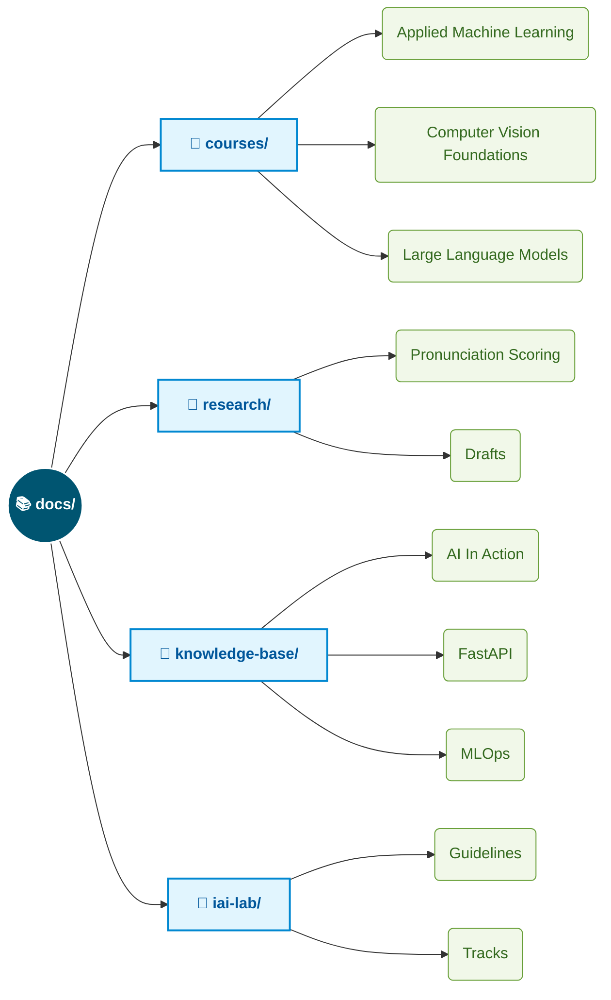

<div align="center">
  <h1>☘️ OpenNotesHub</h1>
  <p><b>A Comprehensive Digital Garden for AI Research, Course Notes & Knowledge Base</b></p>
  <p><i>Curated by <a href="https://nthaihoc.github.io/about-me"><b>Nguyễn Thái Học</b></a> — AI Engineer</i></p>
  
  <p>
    <a href="https://nthaihoc.github.io/open-notes-hub/"></a>
    <a href="https://nthaihoc.github.io/about-me"></a>
    <a href="mailto:thaihoc.ictu@gmail.com"></a>
    <a href="https://scholar.google.com/citations?user=SvS3rssAAAAJ&hl=vi"></a>
    <a href="https://github.com/nthaihoc/open-notes-hub"></a>
  </p>
</div>

## 📖 Repository Overview

**OpenNotesHub** is an open-source digital space where I systematize and share my learning and research journey in Artificial Intelligence (AI). It serves as a centralized hub for core lectures, practical research logs, and specialized technical knowledge.

The goal of this repository is to build an open knowledge base that not only serves personal reference needs but also provides accessible materials for the community, especially beginners exploring Machine Learning, Deep Learning, and Computer Vision.

## 📂 Repository Structure

The repository is strictly organized into major functional directories under `docs/`:



## 🚀 Installation & Deployment

This project is built using the **MkDocs** framework with the **Material for MkDocs** theme. To run this documentation website on your local machine, you need Python installed and follow these steps:

**Step 1: Clone the repository**
```bash
$ git clone https://github.com/nthaihoc/open-notes-hub.git
cd open-notes-hub
```

**Step 2: Install dependencies**
```bash
$ pip install mkdocs-material mkdocs-static-i18n
```

**Step 3: Start the development server**
```bash
$ mkdocs serve
```

Once the server starts, open your browser and navigate to `http://127.0.0.1:8000/open-notes-hub/` to view the website.


## 🤝 Contribution

Contributions are always welcome! Whether it's fixing a typo, adding new lecture notes, or improving the documentation structure, your help is highly appreciated. 

To contribute, please follow these standard open-source steps:
1. **Fork** this repository on GitHub.
2. **Clone** your forked repository to your local machine.
3. Create a **new branch** for your feature or bug fix (`git checkout -b feature/your-feature-name`).
4. **Commit** your changes with descriptive messages.
5. **Push** the branch to your GitHub fork.
6. Submit a **Pull Request** to the `main` branch of this repository for review.

If you encounter any bugs, broken links, or have suggestions for new content, please feel free to open an **Issue**.

## 👏 Acknowledgments

A special thanks to the excellent open-source projects that power this documentation hub:
- **[MkDocs](https://www.mkdocs.org/)**: The core static site generator.
- **[Material for MkDocs](https://squidfunk.github.io/mkdocs-material/)**: The beautiful and highly customizable theme by squidfunk.
- **[mkdocs-static-i18n](https://ultrabug.github.io/mkdocs-static-i18n/)**: The multi-language support plugin by ultrabug.

## ⚖️ License

This repository is distributed under the **MIT License**. You are completely free to use, copy, modify, and redistribute the source code and documentation in this project, provided that the original author is credited. Please see the `LICENSE` file (if available) for more details.

---
*Developed by **Nguyễn Thái Học** - AI Engineer.*