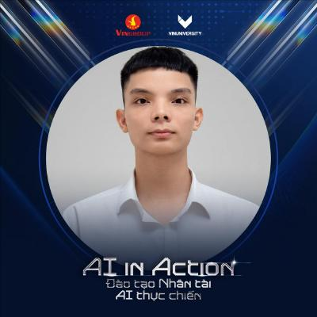

---
hide:
---

#

- 

    
<b>🌴 AI Researcher | AI builder | AI trainer</b>

    

        <a href="https://nthaihoc.github.io/about-me" title="Portfolio">:octicons-home-16:</a>
        <a href="mailto:thaihocit02@gmail.com" title="Email">:material-email:</a>
        <a href="https://github.com/nthaihoc" title="GitHub">:simple-github:</a>
        <a href="https://scholar.google.com/citations?user=SvS3rssAAAAJ&hl=vi" title="Google Scholar">:material-school:</a>
        <a href="https://www.facebook.com/nthoc02" title="Facebook">:simple-facebook:</a>
        <a href="../assets/files/curriculum_vitae.pdf" title="CV">:material-text-box-edit:</a>
    

## Bio
---
👋 Hello, I am **Nguyễn Thái Học** -- an **AI Engineer** at the [Institute of Applied Science and Technology (IAST)](https://iast.ictu.edu.vn), under the [University of Information and Communication Technology (ICTU)](https://ictu.edu.vn). My journey with AI began in 2020, but it was the challenging problems during my junior year of university that truly ignited my profound passion for this field.

Starting as a **Computer Vision** Intern in August 2023 and subsequently taking on the official role of **AI Engineer**, I have transitioned from mastering theoretical foundations to directly developing practical AI solutions for Healthcare and Education. Currently, my research focus revolves around unlocking the potential of **Machine Learning** and **Computer Vision** to solve real-world challenges.

Not stopping there, I am expanding my research boundaries into **Large Language Models (LLMs)** and **Vision-Language Models (VLMs)**, while aiming to optimize deployment pipelines through **MLOps/LLMOps**. To me, AI is not just about algorithms; it is a tool to create positive changes for society.

## News
---
- **[05/2026:]** Admitted as a student for the second cohort of the **AI IN ACTION** training program at VinUniversity.

- **[08/2024:]** Official **AI Engineer** at [IAST](https://iast.ictu.edu.vn).

- **[07/2024:]** Two papers accepted for publication and presentation at the ICTA conference in Phu Tho.

- **[08/2023:]** **Computer Vision** Intern at [IAST](https://iast.ictu.edu.vn).

## Tech Stack & Skills
---

*   **:material-code-tags: Programming Languages:** `Python` `C/C++` `LaTeX` `Markdown`.
*   **:material-brain: ML/DL Frameworks & Architectures:** `PyTorch` `TensorFlow` `Scikit-Learn` `HuggingFace` `Langchain`.
*   **:material-database: Data Processing & Big Data:** `Pandas` `NumPy` `Hadoop` `Spark` `PostgreSQL` `MongoDB`.
*   **:material-toolbox: IDEs, Tools & Ops:** `VS Code` `Git/GitHub` `Docker` `FastAPI` `Linux` `MLflow` `Streamlit`. 

## Publications
---

- 

    **01.** [A Study on Ensemble Learning for Cervical Cytology Classification](https://)

    ---

    **Van-Khanh Tran**, **<u>Thai-Hoc Nguyen</u>**, **Chi-Cuong Nghiem**, **Xuan-Lam Dinh**

    *International Conference on Advances in Information and Communication Technology (ICTA), 2024.*

    **Keywords:** `Ensemble Learning` `Cervical Cancer Cytology` `Deep Learning`

- 

    **02.** [An automatic machine learning based customer segmentation model with RFM analysis](https://)

    ---

    **Xuan-Thi Tran**, **<u>Thai-Hoc Nguyen</u>**

    *International Conference on Advances in Information and Communication Technology (ICTA), 2024.*

    **Keywords:** `Customer Segmentation` `RFM` `K-means Clustering` `Hadoop` `Spark`

---

---