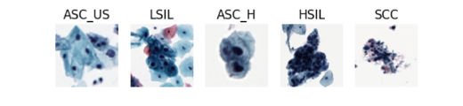
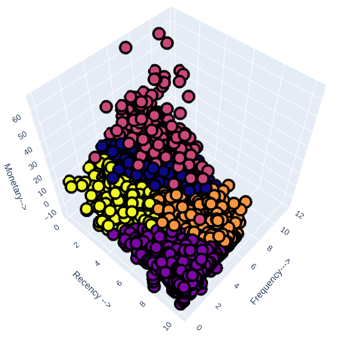

---
hide:
---

#

- 

    
<b>🌴 AI Researcher | AI builder | AI trainer</b>

    

        <a href="https://nthaihoc.github.io/about-me" title="Portfolio">:octicons-home-16:</a>
        <a href="mailto:thaihocit02@gmail.com" title="Email">:material-email:</a>
        <a href="https://github.com/nthaihoc" title="GitHub">:simple-github:</a>
        <a href="https://scholar.google.com/citations?user=SvS3rssAAAAJ&hl=vi" title="Google Scholar">:material-school:</a>
        <a href="https://www.facebook.com/nthoc02" title="Facebook">:simple-facebook:</a>
        <a href="../assets/files/curriculum_vitae.pdf" title="CV">:material-text-box-edit:</a>
    

## Giới thiệu
---
👋 Xin chào, tôi là **Nguyễn Thái Học** -- một **AI Engineer** tại [Viện Khoa học và Công nghệ Ứng dụng (IAST)](https://iast.ictu.edu.vn), trực thuộc [Trường Đại học Công nghệ Thông tin và Truyền thông (ICTU)](https://ictu.edu.vn). Hành trình với AI của tôi bắt đầu từ năm 2020, nhưng chính những bài toán đầy thách thức trong năm thứ 3 đại học đã thực sự thắp sáng ngọn lửa đam mê sâu sắc của tôi với lĩnh vực này.

Bắt đầu với vai trò Thực tập sinh **Computer Vision** vào tháng 8/2023 và sau đó chính thức đảm nhận vị trí **AI Engineer**, tôi đã chuyển mình từ việc nắm vững các nền tảng lý thuyết sang trực tiếp phát triển các giải pháp AI thực tiễn trong lĩnh vực Y tế và Giáo dục. Hiện tại, trọng tâm nghiên cứu của tôi xoay quanh việc khai phá tiềm năng của **Machine Learning** và **Computer Vision** để giải quyết các bài toán trong thế giới thực.

Không dừng lại ở đó, tôi đang mở rộng ranh giới nghiên cứu của mình sang **Large Language Models (LLMs)** và **Vision-Language Models (VLMs)**, đồng thời hướng tới việc tối ưu hóa quy trình triển khai mô hình thông qua **MLOps/LLMOps**. Đối với tôi, AI không chỉ là những thuật toán khô khan; nó là công cụ để tạo ra những thay đổi tích cực cho xã hội.

## Tin tức
---
- **[05/2026:]** Trở thành học viên khóa 2 của chương trình đào tạo **AI Thực Chiến** tại VinUniversity.

- **[08/2024:]** Chính thức trở thành **AI Engineer** tại [IAST](https://iast.ictu.edu.vn).

- **[07/2024:]** Có hai bài báo được chấp nhận xuất bản và báo cáo tại Hội thảo Quốc tế ICTA, Phú Thọ.

- **[08/2023:]** Bắt đầu làm Thực tập sinh **Computer Vision** tại [IAST](https://iast.ictu.edu.vn).

## Kỹ năng & Công nghệ
---

*   **:material-code-tags: Ngôn ngữ lập trình:** `Python` `C/C++` `LaTeX` `Markdown`.
*   **:material-brain: Framework & Kiến trúc ML/DL:** `PyTorch` `TensorFlow` `Scikit-Learn` `HuggingFace` `Langchain`.
*   **:material-database: Xử lý dữ liệu & Big Data:** `Pandas` `NumPy` `Hadoop` `Spark` `PostgreSQL` `MongoDB`.
*   **:material-toolbox: IDE, Công cụ & Ops:** `VS Code` `Git/GitHub` `Docker` `FastAPI` `Linux` `MLflow` `Streamlit`. 

## Công bố Khoa học
---

- 

    **01.** [A Study on Ensemble Learning for Cervical Cytology Classification](https://)

    ---

    **Van-Khanh Tran**, **<u>Thai-Hoc Nguyen</u>**, **Chi-Cuong Nghiem**, **Xuan-Lam Dinh**

    *International Conference on Advances in Information and Communication Technology (ICTA), 2024.*

    **Từ khóa:** `Ensemble Learning` `Cervical Cancer Cytology` `Deep Learning`

- 

    **02.** [An automatic machine learning based customer segmentation model with RFM analysis](https://)

    ---

    **Xuan-Thi Tran**, **<u>Thai-Hoc Nguyen</u>**

    *International Conference on Advances in Information and Communication Technology (ICTA), 2024.*

    **Từ khóa:** `Customer Segmentation` `RFM` `K-means Clustering` `Hadoop` `Spark`

---

---