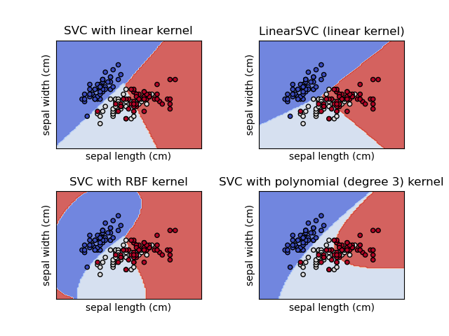
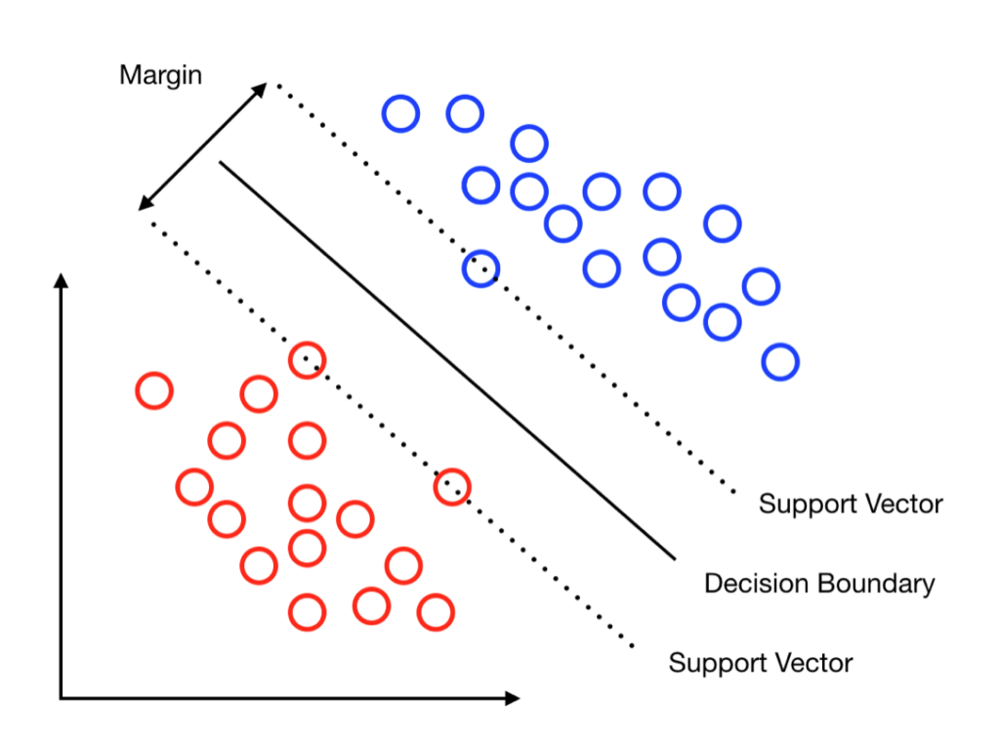
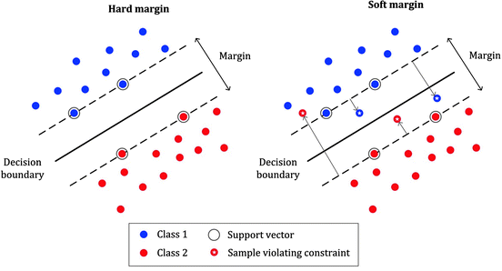

#<center>Support Vector Machines</center>

</img>

## 1. Theoretical Foundations
---
Support Vector Machine (SVM) là một mô hình Học Máy mạnh mẽ và linh hoạt, đặc biệt phù hợp với các tập dữ liệu có kích thước vừa và nhỏ. Nó có khả năng giải quyết đa dạng các bài toán như phân loại tuyến tính, phi tuyến, hồi quy, và phát hiện điểm bất thường (outlier detection).

Ý tưởng cơ bản của SVM là tạo ra một siêu mặt phẳng (hyperplane) không chỉ tách biệt hai lớp dữ liệu mà còn giữ khoảng cách xa nhất có thể tới các mẫu huấn luyện gần nhất của từng lớp. Ta có thể hình dung rằng mô hình SVM cố gắng tìm một con đường rộng nhất có thể chạy giữa các lớp. Do đó, kỹ thuật này còn được gọi là phân loại lề lớn (Large Margin Classification).

<div class="figure-environment">
    <div class="subfigure-container">
        <figure class="subfigure">
            
        </figure>
    </div>
</div>

/// caption
**Hình 1:** Minh họa không gian hai chiều của thuật toán Support Vector Machine (SVM), thể hiện ranh giới quyết định tối ưu được xây dựng dựa trên nguyên lý tối đa hóa khoảng lề (margin) giữa các véc-tơ hỗ trợ (support vectors) của hai lớp dữ liệu riêng biệt.
///

### 1.1 Hard-margin Classification
---
Mô hình phân loại SVM dựa trên một hàm quyết định liên tục $f(\mathbf{x}) = \mathbf{w}^\top\mathbf{x} + b$, với $b$ là hệ số dịch chuyển (bias) và $\mathbf{w}$ là vector trọng số. Nhãn dự đoán cuối cùng $\hat{y}$ của một mẫu dữ liệu mới $\mathbf{x}$ được xác định dựa trên dấu của hàm quyết định này: Nếu $f(\mathbf{x}) \ge 0$, mẫu được gắn nhãn thuộc lớp dương ($+1$); ngược lại nếu $f(\mathbf{x}) < 0$, mẫu thuộc lớp âm ($-1$). 

Với cách tiếp cận cơ bản nhất là biên cứng (Hard-margin), SVM yêu cầu toàn bộ tập dữ liệu huấn luyện phải có sự phân tách tuyến tính hoàn hảo. Lối tiếp cận này khá cực đoan, nếu tồn tại nhiễu (noise) hoặc các điểm dữ liệu đan xen vào nhau, thuật toán sẽ hoàn toàn bế tắc trong việc tìm ra bộ nghiệm.

Trong không gian hình học, khoảng cách từ ranh giới quyết định đến các điểm dữ liệu gần nhất (được gọi là Support Vectors) tạo thành độ rộng của lề. Theo đại số tuyến tính, độ rộng của lề này được tính bằng $\frac{2}{||\mathbf{w}||}$. Do đó, để tối đa hóa không gian ranh giới, ta bắt buộc phải thu nhỏ $||\mathbf{w}||$. Đồng thời, để đảm bảo không có bất kỳ điểm dữ liệu nào vi phạm vào khu vực lề, hàm quyết định cần sinh ra giá trị $\ge 1$ đối với mọi mẫu dương ($y^{(i)} = +1$) và $\le -1$ đối với mọi mẫu âm ($y^{(i)} = -1$). Gộp chung hai trường hợp này, ta thu được điều kiện ràng buộc tổng quát: $y^{(i)} \bigl( \mathbf{w}^\top \mathbf{x}^{(i)} + b \bigr) \ge 1$.

Tuy nhiên, dấu căn bậc hai trong biểu thức tính chuẩn $||\mathbf{w}||$ gây ra những rào cản lớn trong việc lấy đạo hàm. Để vượt qua nút thắt này, thay vì cực tiểu hóa $||\mathbf{w}||$, ta chuyển sang cực tiểu hóa một nửa bình phương của nó: $\frac{1}{2}||\mathbf{w}||^2$ (hoặc viết dưới dạng ma trận là $\frac{1}{2}\mathbf{w}^\top \mathbf{w}$). Vì $||\mathbf{w}||$ luôn mang giá trị không âm, thao tác này không làm thay đổi vị trí của điểm cực trị nhưng lại biến hàm mục tiêu thành một hàm lồi (convex) tuyệt đẹp, dễ dàng giải quyết bằng các phương pháp đạo hàm.

Từ những lập luận trên, bài toán tối ưu SVM biên cứng được thiết lập dưới dạng một hệ quy hoạch như sau:

$$ 
\begin{equation}
\min_{\mathbf{w}, b} \frac{1}{2} \mathbf{w}^\top \mathbf{w}, \;\;
\text{sao cho } y^{(i)} \bigl( \mathbf{w}^\top \mathbf{x}^{(i)} + b \bigr) \ge 1, \quad \forall i = 1, 2, \dots, m 
\end{equation}
$$


### 1.2 Soft-margin Classification
---
Như đã đề cập ở phần trước đó, phân loại biên cứng yêu cầu dữ liệu phải có sự tách biệt tuyến tính, tuy nhiên trong thực tế dữ liệu có chứa rất nhiều nhiễu và chồng chéo lên nhau. Để khắc phục điểm yếu chí mạng này, khái niệm **Soft-margin SVM (SVM Biên mềm)** được giới thiệu (Hình 2). Bằng cách nới lỏng các ràng buộc, thuật toán cho phép một vài điểm dữ liệu được phép vi phạm ranh giới (phân loại sai), từ đó tìm ra một siêu phẳng phân tách linh hoạt và có tính tổng quát hóa cao hơn.

<div class="figure-environment">
    <div class="subfigure-container">
        <figure class="subfigure">
            
        </figure>
    </div>
</div>

/// caption
**Hình 2:** So sánh trực quan giữa SVM Hard Margin (phân tách dữ liệu tuyệt đối, lề hẹp) và SVM Soft Margin (chấp nhận một số điểm vi phạm lề để tối đa hóa khoảng lề, tăng khả năng tổng quát hóa).
///

Để cho phép sai số, phân loại biên mềm đưa vào một **biến bù (slack variable)** $\xi^{(i)} \ge 0$ cho từng mẫu dữ liệu. Biến $\xi^{(i)}$ đóng vai trò đo lường mức độ vi phạm lề của mẫu thứ $i$. Đến đây, bài toán xuất hiện hai mục tiêu mâu thuẫn nhau:

- Cực tiểu hóa $\sum \xi^{(i)}$ để mô hình ít vi phạm lề nhất (phân loại chính xác nhất).

- Cực tiểu hóa $\frac{1}{2} \mathbf{w}^\top \mathbf{w}$ để độ rộng biên lớn nhất (tổng quát hóa tốt nhất).

Để giải quyết sự giằng co này, ta sử dụng thêm một siêu tham số $C$ để điều chỉnh cán cân đánh đổi (trade-off) giữa hai mục tiêu. Bài toán tổng quát của Soft-margin SVM trở thành:

$$ 
\begin{equation}
\min_{\mathbf{w}, b, \xi} \left( \frac{1}{2} \mathbf{w}^\top \mathbf{w} + C \sum_{i=1}^m \xi^{(i)} \right) 
\end{equation}
$$

$$
\begin{equation}
\text{sao cho }
y^{(i)} \bigl( \mathbf{w}^\top \mathbf{x}^{(i)} + b \bigr) \ge 1 - \xi^{(i)}, \quad \xi^{(i)} \ge 0, \quad \forall i = 1, 2, \dots, m 
\end{equation} 
$$

### 1.3 Quadratic Programming
---
Như chúng ta đã biết, hàm mục tiêu cho bộ phân loại biên cứng và cả biên mềm là bài toán tối ưu lồi bậc hai với ràng buộc tuyến tính bậc một. Để giải quyết bài toán này, người ta sử dụng kỹ thuật Quadratic Programming - QP (Quy hoạch toàn phương). Công thức tổng quát của bài toán QP:

$$
\begin{equation}
\min_{\mathbf{p}} \frac{1}{2}\mathbf{p}^\top \mathbf{H}\mathbf{p} + \mathbf{f}^\top \mathbf{p}, \quad\text{sao cho } \mathbf{Ap} \le \mathbf{b}
\end{equation}
$$

Bộ giải QP không biết SVM là gì, không biết đường phân cách hay lề là gì, chúng chỉ nhận đúng một định dạng đầu vào duy nhất. Nhiệm vụ của chúng ta là thiết kế bài toán SVM sao cho vừa vặn với cấu trúc này. Trong SVM, ta cần tìm độ lệch $b$ (bias) và vector trọng số $w = \left[ w_1, w_2, \dots, w_n \right]^\top$, nhưng QP chỉ nhận một vector duy nhất là $\mathbf{p}$. Vì vậy, ta gộp chúng lại với nhau. Số lượng biến lúc này là $n_p = n + 1$, với vector $\mathbf{p} = \left[ b, w_1, \dots, w_n \right]^\top$.

SVM muốn cực tiểu hoá $\frac{1}{2}\left\|w \right\|^2$, nhưng hệ số $b$ không có mặt trong mục tiêu cực tiểu hoá này. Để cụm $\mathbf{p}^\top \mathbf{H}\mathbf{p}$ của QP sinh ra đúng bình phương các trọng số, ma trận $\mathbf{H}$ phải là ma trận đơn vị có đường chéo bằng $1$. Tuy nhiên, để triệt tiêu hoàn toàn biến $b$ ra khỏi hàm mục tiêu, ô đầu tiên trên cùng bên trái của $\mathbf{H}$ bắt buộc phải bằng $0$.

$$
\begin{equation}
\mathbf{H} \cdot \mathbf{p} =
\begin{bmatrix}
0 & 0 & \dots & 0 \\
0 & 1 & \dots & 0 \\
\vdots & \vdots & \ddots & \vdots \\
0 & 0 & \dots & 1
\end{bmatrix}
\begin{bmatrix}
b \\
w_1 \\
\vdots \\
w_n
\end{bmatrix}
= 
\begin{bmatrix}
0 \\
w_1 \\
\vdots \\
w_n
\end{bmatrix}
\end{equation}
$$

Khi nhân tiếp với $\mathbf{p}^\top$:

$$
\begin{equation}
\mathbf{p}^\top (\mathbf{Hp}) =
\left[ b, w_1, \dots, w_n \right]
\begin{bmatrix}
0 \\
w_1 \\
\vdots \\
w_n
\end{bmatrix}
= 0 + w_1^{2} + \dots + w_n^{2}
\end{equation}
$$

Dễ dàng nhận thấy, khi thêm hệ số $\frac{1}{2}$ ở đầu, ta thu được chính xác hàm mục tiêu của SVM. Tương tự, ta triệt tiêu cụm $\mathbf{f}^\top \mathbf{p}$ bằng cách ép toàn bộ vector $\mathbf{f}$ mang giá trị $0$. Bộ giải QP vốn ngây ngô, nếu ta không gán $\mathbf{f} = \mathbf{0}$, thuật toán sẽ tìm cách tối ưu cả thành phần bậc một này. Điều đó vô tình làm cho vector $\mathbf{w}$ bị kéo dài ra một cách vô lý, dẫn đến con đường phân cách (margin) bị bóp nghẹt lại một cách oan uổng.

Về phần ràng buộc, điều kiện gốc của SVM là $t^{(i)}(w^\top x^{(i)} + b) \ge 1$. Tuy nhiên, QP chỉ hiểu dấu nhỏ hơn hoặc bằng ($\le$). Để bẻ cong ràng buộc, ta nhân cả hai vế với $-1$, đảo chiều bất đẳng thức thành: $-t^{(i)} \left( w^\top x^{(i)} + b \right) \le -1$. Lúc này, vế phải của QP là một vector $\mathbf{b}$ chứa toàn số $-1$.

Vế trái của bất đẳng thức chính là kết quả phép nhân giữa một hàng trong ma trận $\mathbf{A}$ với vector cột $\mathbf{p}$. Nhiệm vụ là tìm ra cấu trúc của hàng $a^{(i)}$ này. Bằng một thủ thuật đơn giản, gọi vector dữ liệu gốc là $\mathbf{x} = \left[ x_1, x_2, \dots, x_n \right]$, ta thêm một đặc trưng giả có giá trị bằng $1$ vào ngay đầu vector. Khi đó, phép nhân tạo ra:

$$
\begin{equation}
a^{(i)} = \mathbf{x} \cdot \mathbf{p} = 
\left[ 1, x_1, x_2, \dots, x_n \right]
\begin{bmatrix}
b \\
w_1 \\
w_2 \\
\vdots \\
w_n
\end{bmatrix}
=
1b + x_1w_1 + x_2w_2 + \dots + x_nw_n
\end{equation}
$$

Nhưng cụm này vẫn thiếu đi nhãn dữ liệu $y^{(i)}$ và dấu trừ để đảo chiều. Do đó, toàn bộ vector hàng này cần được nhân với $-y^{(i)}$. Chốt lại, một hàng của ma trận $\mathbf{A}$ sẽ có dạng: $a^{(i)} = -y^{(i)} \left[ 1, x_1, x_2, \cdots, x_n \right]$. Kiểm chứng lại bằng phép nhân vô hướng với $\mathbf{p}$:

$$
\begin{equation}
a^{(i)} \cdot p = \left( -y^{(i)} \left[ 1, x_1, x_2, \cdots, x_n \right] \right)
\begin{bmatrix}
b \\
w_1 \\
\vdots \\
w_n
\end{bmatrix}
=
-y^{(i)} \left( b + x_1w_1 + \dots + x_nw_n \right)
\end{equation}
$$

Đến đây, biểu thức đã khớp hoàn hảo với vế trái của bất phương trình SVM. Sau khi đã mổ xẻ từng thành phần toán học của QP, bước cuối cùng là lắp ráp chúng vào một khuôn đúc tổng quát. Bài toán huấn luyện SVM biên cứng lúc này được tóm gọn lại một cách trọn vẹn và hoàn toàn tương thích với ngôn ngữ của máy tính:

Mục tiêu của bài toán là tìm ra vector tối ưu $\mathbf{p}^* = \left[ b, w_1, \dots, w_n \right]^\top$ thông qua việc giải hệ tối ưu:

$$
\begin{equation}
\min_{\mathbf{p}} \frac{1}{2}\mathbf{p}^\top \mathbf{H}\mathbf{p} + \mathbf{f}^\top \mathbf{p}
, \quad
\text{sao cho } \mathbf{A}\mathbf{p} \le \mathbf{b}_{qp}
\end{equation}
$$

Trong đó, bộ 4 tham số cấu hình được định nghĩa vô cùng nghiêm ngặt:

- $\mathbf{H}$: Ma trận vuông kích thước $(n+1) \times (n+1)$, với ô $\mathbf{H}_{00} = 0$ (để triệt tiêu $b$) và phần còn lại là ma trận đơn vị.

- $\mathbf{f}$: Vector cột kích thước $(n+1) \times 1$ chứa toàn bộ là số $0$ (để vô hiệu hóa các hạng tử bậc một).

- $\mathbf{A}$: Ma trận ràng buộc kích thước $m \times (n+1)$ (với $m$ là tổng số mẫu huấn luyện). Mỗi hàng của $\mathbf{A}$ được cấu trúc theo công thức 9.

- $\mathbf{b}_{qp}$: Vector cột kích thước $m \times 1$ chứa toàn bộ là số $-1$.

Khi ta nạp bộ tham số $(\mathbf{H}, \mathbf{f}, \mathbf{A}, \mathbf{b}_{qp})$ này vào bất kỳ một thư viện giải toán tối ưu nào (như `CVXOPT` trong Python), cỗ máy QP sẽ tự động lần mò trong không gian nhiều chiều và trả về cho ta nghiệm $\mathbf{p}^*$. Từ vector nghiệm này, ta chỉ việc trích xuất phần tử đầu tiên làm hệ số điều chỉnh $b^*$, và các phần tử còn lại làm vector trọng số $\mathbf{w}^*$. Bức tranh phân loại của SVM đến đây chính thức được giải quyết trọn vẹn bằng Đại số tuyến tính. Tương tự, ta cũng có thể sử dụng các bộ giải quy hoạch toàn phương để giải bài toán biên mềm. 

### 1.4 Dual Problem
---
Bài toán Gốc (Primal Problem) của Soft Margin SVM đối mặt với một giới hạn nghiêm trọng về mặt giải tích: Việc tìm kiếm cực tiểu bị trói buộc bởi $2m$ điều kiện bất đẳng thức cứng (ràng buộc lấn lề và ràng buộc tính dương). Các phương pháp đạo hàm truyền thống không thể áp dụng trực tiếp lên một không gian nghiệm bị giới hạn bởi các bất đẳng thức này.

Để phá vỡ nút thắt đó, ta áp dụng **Phương pháp Nhân tử Lagrange**. Triết lý cốt lõi của phương pháp này là loại bỏ hoàn toàn các ranh giới cứng, cho phép các biến số gốc $(\mathbf{w}, b, \boldsymbol{\xi})$ biến thiên tự do trong không gian. Tuy nhiên, để đảm bảo mô hình không vi phạm các quy tắc của SVM, các điều kiện ràng buộc sẽ được tích hợp trực tiếp vào hàm mục tiêu dưới dạng các hình phạt (penalty terms).

Cụ thể, với mỗi một điều kiện bất phương trình, ta sẽ gán cho nó một **Nhân tử Lagrange** (đóng vai trò như một trọng số phạt không âm).

- Gán vector nhân tử $\boldsymbol{\alpha} = [\alpha_1, \dots, \alpha_m]^\top \ge 0$ cho $m$ ràng buộc lấn lề: $1 - \xi_i - t^{(i)}(\mathbf{w}^\top \mathbf{x}^{(i)} + b) \le 0$.
- Gán vector nhân tử $\boldsymbol{\mu} = [\mu_1, \dots, \mu_m]^\top \ge 0$ cho $m$ ràng buộc tính dương: $-\xi_i \le 0$.

Khi dung hợp hàm mục tiêu ban đầu với các hạng tử phạt này, ta kiến tạo nên một hàm mục tiêu tổng quát, liên tục và có thể đạo hàm được, gọi là **Hàm Lagrange ($\mathcal{L}$)**:

$$ 
\begin{aligned}
\mathcal{L}(\mathbf{w}, b, \boldsymbol{\xi}, \boldsymbol{\alpha}, \boldsymbol{\mu}) =& \ \frac{1}{2} \|\mathbf{w}\|^2 
    + C\sum^m_{i=1}\xi_i \\
    &+ \sum^m_{i=1}\alpha_i\bigl[1 - \xi_i - t^{(i)}(\mathbf{w}^\top\mathbf{x}^{(i)} + b)\bigr] \\
    &- \sum^m_{i=1}\mu_i\xi_i
\end{aligned}
$$

Sự biến đổi này định hình lại hoàn toàn bản chất tối ưu hóa. Từ một bài toán cực tiểu hóa đơn thuần có ràng buộc, hệ thống trở thành một trò chơi đối kháng **Min-Max** không ràng buộc: Ta tìm cách cực tiểu hóa (Minimize) hàm $\mathcal{L}$ theo các biến gốc $(\mathbf{w}, b, \boldsymbol{\xi})$, đồng thời cực đại hóa (Maximize) hình phạt thông qua các biến đối ngẫu $(\boldsymbol{\alpha}, \boldsymbol{\mu})$ để ép hệ thống phải tuân thủ nghiêm ngặt các ranh giới.

Để chuẩn bị cho việc thiết lập hệ điều kiện đạo hàm ở bước tiếp theo, ta tiến hành phá ngoặc hàm $\mathcal{L}$ và gom nhóm các hạng tử theo từng biến số gốc:

$$
\begin{equation}
\begin{aligned}
\mathcal{L}(\mathbf{w}, b, \boldsymbol{\xi}, \boldsymbol{\alpha}, \boldsymbol{\mu}) =& \ \frac{1}{2}\|\mathbf{w}\|^2
 + C \sum_{i=1}^m \xi_i \\
&+ \sum_{i=1}^m \alpha_i
 - \sum_{i=1}^m \alpha_i \xi_i
 - \sum_{i=1}^m \alpha_i t^{(i)} \mathbf{w}^\top \mathbf{x}^{(i)} 
 - \sum_{i=1}^m \alpha_i t^{(i)} b \\
&- \sum_{i=1}^m \mu_i \xi_i \\
=& \ \frac{1}{2}\|\mathbf{w}\|^2 - \left( \sum^m_{i=1}\alpha_i t^{(i)} \mathbf{x}^{(i)} \right)^\top \mathbf{w} \\
&- b \sum_{i=1}^m \alpha_i t^{(i)} \\
&+ \sum_{i=1}^m \xi_i \left( C - \alpha_i - \mu_i \right) \\
&+ \sum_{i=1}^m \alpha_i
\end{aligned}
\end{equation}
$$

Để tìm chiến lược tối ưu cho phe cực tiểu hóa, ta áp dụng các điều kiện đầu tiên của KKT. Tại điểm tối ưu cục bộ, đạo hàm riêng của hàm $\mathcal{L}$ theo các biến gốc $(\mathbf{w}, b, \boldsymbol{\xi})$ bắt buộc phải triệt tiêu bằng $0$.  Nhờ việc đã phân tách và gom nhóm các biến số ở phương trình trước, thao tác đạo hàm diễn ra vô cùng đơn giản

**Đạo hàm theo $\mathbf{w}$:**
$$ 
\begin{equation}
\frac{\partial \mathcal{L}}{\partial \mathbf{w}} = \mathbf{w} - \sum_{i=1}^m \alpha_i t^{(i)} \mathbf{x}^{(i)} = 0 \quad \Rightarrow \quad \mathbf{w} = \sum_{i=1}^m \alpha_i t^{(i)} \mathbf{x}^{(i)} 
\end{equation}
$$

Phương trình này đã vô tình phát hiện ra tính chất quan trọng của SVM. Vector trọng số phân lớp $\mathbf{w}$ không tồn tại độc lập, mà nó là một tổ hợp tuyến tính của chính các điểm dữ liệu trong tập huấn luyện. Những điểm có $\alpha_i = 0$ sẽ hoàn toàn vô tác dụng, chỉ những điểm có mức phạt $\alpha_i > 0$ mới đóng góp vào việc dựng lên bức tường ranh giới $\mathbf{w}$. Những điểm này vì thế được gọi là support vector (vector hỗ trợ)

**Đạo hàm theo $b$:**
$$ 
\begin{equation}
\frac{\partial \mathcal{L}}{\partial b} = - \sum_{i=1}^m \alpha_i t^{(i)} = 0 \quad \Rightarrow \quad \sum_{i=1}^m \alpha_i t^{(i)} = 0 
\end{equation}
$$

Đây là định luật bảo toàn lực kéo. Tổng lực trừng phạt tác động lên các support vectors thuộc lớp positive ($t=+1$) phải cân bằng tuyệt đối với tổng lực tác động lên lớp negative ($t=-1$). Nếu không có sự cân bằng này, đường ranh giới sẽ bị trôi tuột về vô cực.

**Đạo hàm theo $\xi_i$:**
$$ 
\begin{equation}
\frac{\partial \mathcal{L}}{\partial \xi_i} = C - \alpha_i - \mu_i = 0 \quad \Rightarrow \quad \alpha_i + \mu_i = C 
\end{equation}
$$

Vì theo luật KKT, cả hai nhân tử Lagrange đều phải không âm ($\alpha_i \ge 0$ và $\mu_i \ge 0$), phương trình này ép buộc $\alpha_i$ không bao giờ được vượt quá $C$. Tức là: $0 \le \alpha_i \le C$. Dù một điểm nhiễu (outlier) có vi phạm nghiêm trọng đến đâu, mức phạt tối đa mà nó có thể gây ra để bẻ cong đường ranh giới cũng bị giới hạn ở ngưỡng $C$. Ngoài ra, hệ thống vẫn phải tuân thủ nghiêm ngặt điều kiện độ lơi lỏng bù trừ đối với 2 ràng buộc ban đầu: (1) $\alpha_i \left[ 1 - \xi_i - t^{(i)}(\mathbf{w}^\top \mathbf{x}^{(i)} + b) \right] = 0$ và (2) $\mu_i \xi_i = 0$

Sau khi đã hoàn tất việc lấy đạo hàm, bước tiếp theo ta sẽ thế ngược toàn bộ các kết quả đạo hàm này trở lại hàm $\mathcal{L}$ để triệt tiêu hoàn toàn các biến gốc $\left(\mathbf{w}, b, \boldsymbol{\xi}\right)$. Mục tiêu là đưa phương trình thoát hẳn ra khỏi không gian chứa các biến gốc rườm rà, chuyển hoá hoàn toàn thành một hàm chỉ phụ thuộc vào nhân tử $\boldsymbol{\alpha}$.

Trước tiên ta dễ dàng triệt tiêu $b$ và $\xi$ khi thay thế (13), (14) vào biểu thức (11). Lúc này bài toán khồng lồ được thu gọn lại như sau:

$$
\begin{equation}
\mathcal{L} = \frac{1}{2} \left\|\mathbf{w}\right\|^2 - \left(\sum^m_{i=1} \alpha_i t^{(i)} \mathbf{x}^{(i)}\right)^\top \mathbf{w} + \sum^m_{i=1} \alpha_i
\end{equation}
$$

Công thức (15) có thể tiếp tục rút gọn thành:

$$
\begin{equation}
\mathcal{L} = \frac{1}{2} \left\|\mathbf{w}\right\|^2 - \mathbf{w}^\top \mathbf{w} + \sum^m_{i=1} \alpha_i
\end{equation}
$$

Vì $\mathbf{w}^\top \mathbf{w} = \left\|\mathbf{w}\right\|^2$, biểu thức tiếp tục thu gọn thành:

$$
\begin{equation}
\mathcal{L} = \sum^m_{i=1} \alpha_i - \frac{1}{2} \left\|\mathbf{w}\right\|^2
\end{equation}
$$

Cuối cùng ta khai triển $\left\|\mathbf{w}\right\|^2$ thu được:

$$
\begin{equation}
\left\|\mathbf{w}\right\|^2 = \left(\sum^m_{i=1} \alpha_i t^{(i)} \mathbf{x}^{(i)}\right)^\top \left(\sum^m_{j=1} \alpha_j t^{(j)} \mathbf{x}^{(j)}\right) =
\sum^m_{i=1} \sum^m_{j=1} \alpha_i \alpha_j t^{(i)} t^{(j)} (\mathbf{x}^{(i)})^\top \mathbf{x}^{(j)}
\end{equation}
$$

Thay thế (18) vào (17) ta thu được một hàm mục tiêu hoàn toàn mới, gọi là hàm mục tiêu đối ngẫu (dual objective) kí hiệu là $W\left(\alpha\right)$:

<a id="eq1"></a>

$$
\begin{equation}
\max_{\alpha} W\left(\alpha\right) = \sum^m_{i=1} \alpha_i - \frac{1}{2} \sum^m_{i=1} \sum^m_{j=1} \alpha_i \alpha_j t^{(i)} t^{(j)} (\mathbf{x}^{(i)})^\top \mathbf{x}^{(j)}
\end{equation}
$$

Nhiệm vụ cuối cùng của thuật toán SVM là cực đại hoá hàm $W\left(\alpha\right)$ này qua việc tuân thủ chặt chẽ hai điều kiện ràng buộc (1) $\sum^m_{i=1} \alpha_i t^{(i)} = 0$ và (2) $0 \le \alpha_i \le C \;\; \forall{i}$ 

### 1.5 Kernel Trick
---
Trong không gian ban đầu, để phân loại một điểm dữ liệu $\mathbf{x}$, hệ thống cần biết chính xác toạ độ của chúng. Nhưng khi chuyển sang không gian đối ngẫu, trong phương trình (19) chúng ta có thể thấy rằng sự xuất hiện của cụm $(\mathbf{x}^{(i)})^\top \mathbf{x}^{(j)}$ đã thay đổi hoàn toàn luật chơi. Đây chính là tích vô hướng, hay còn gọi là thước đo sự tương đồng giữa hai vector. Thuật toán SVM nhận ra rằng, nó không cần biết chính xác toạ độ của từng điểm dữ liệu, nó chỉ quan tâm điểm dữ liệu đó giống hay khác với các dữ liệu còn lại như thế nào. Tuy nhiên, cụm $(\mathbf{x}^{(i)})^\top \mathbf{x}^{(j)}$ chỉ biểu diễn sự tương quan tuyến tính trên không gian đặc trưng gốc. Đối với các tập dữ liệu đan xen phức tạp, việc tìm kiếm một siêu mặt phẳng phân cách trực tiếp trong không gian gốc là điều bất khả thi.

Một giải pháp trực quan là sử dụng một hàm ánh xạ phi tuyến $\phi(\mathbf{x})$ để phóng chiếu dữ liệu từ không gian ban đầu lên một không gian mới có số chiều lớn hơn (hoặc vô hạn chiều), nơi tập dữ liệu có thể được phân tách tuyến tính. Khi đó, cụm tích vô hướng trong hàm mục tiêu sẽ được thay thế bằng $\phi(\mathbf{x}^{(i)})^\top \phi(\mathbf{x}^{(j)})$. Tuy nhiên, việc tính toán trực tiếp toạ độ của $\phi(\mathbf{x})$ trong không gian đa chiều này là điều không thể, vì nó đòi hỏi khối lượng xử lý khổng lồ, dẫn đến thảm họa bùng nổ số chiều (curse of dimensionality).

Đúng tại thời điểm bế tắc này, hình thái của bài toán đối ngẫu đã bộc lộ giá trị then chốt. Như đã đề cập ở phía trên, hệ thống không cần biết toạ độ tuyệt đối của các điểm dữ liệu trong không gian mới, thứ duy nhất nó cần là kết quả cuối cùng của phép nhân vô hướng $\phi(\mathbf{x}^{(i)})^\top \phi(\mathbf{x}^{(j)})$. Từ đây, một giải pháp toán học đột phá mang tên **Kernel Trick** ra đời. 

Ta định nghĩa một hàm số $K\left(\mathbf{x}^{(i)}, \mathbf{x}^{(j)}\right) = \phi(\mathbf{x}^{(i)})^\top \phi(\mathbf{x}^{(j)})$. Hàm này cho phép hệ thống tính toán trực tiếp giá trị của tích vô hướng ở không gian vô hạn chiều thông qua các phép toán đơn giản ngay tại không gian gốc, gạt bỏ hoàn toàn chi phí tính toán biến đổi toạ độ. Hàm mục tiêu (19) lúc này được tổng quát hoá thành:

$$
\begin{equation}
\max_{\mathbf{\alpha}} W\left(\mathbf{\alpha}\right) = \sum^m_{i=1} \alpha_i - \frac{1}{2} \sum^m_{i=1} \sum^m_{j=1} \alpha_i \alpha_j t^{\left(i\right)} t^{\left(j\right)} K\left(\mathbf{x}^{(i)}, \mathbf{x}^{(j)}\right)
\end{equation}
$$

Để minh chứng cho sự kỳ diệu này, giả sử ta muốn áp dụng phép biến đổi đa thức bậc 2 cho hai vector 2 chiều $\mathbf{a} = [a_1, a_2]^\top$ và $\mathbf{b} = [b_1, b_2]^\top$. Tích vô hướng của hai vector sau khi được ánh xạ lên không gian 3 chiều sẽ được tính như sau:

$$
\begin{equation}
\begin{aligned}
\phi(\mathbf{a})^\top \phi(\mathbf{b}) &= 
\begin{bmatrix} {a_1}^2 \\ \sqrt{2}a_1a_2 \\ {a_2}^2 \end{bmatrix}^\top
\begin{bmatrix} {b_1}^2 \\ \sqrt{2}b_1b_2 \\ {b_2}^2 \end{bmatrix} \\
&= {a_1}^2{b_1}^2 + 2a_1b_1a_2b_2 + {a_2}^2{b_2}^2 \\
&= \left(a_1b_1 + a_2b_2\right)^2 \\
&= \left( \begin{bmatrix}a_1 \\ a_2\end{bmatrix}^\top \begin{bmatrix}b_1 \\ b_2\end{bmatrix} \right)^2 = \left(\mathbf{a}^\top \mathbf{b} \right)^2
\end{aligned}
\end{equation}
$$

Ta dễ dàng thấy rằng, tích vô hướng của hai vector đã được biến đổi có giá trị bằng đúng bình phương tích vô hướng của hai vector ban đầu $\phi(\mathbf{a})^\top \phi(\mathbf{b}) = (\mathbf{a}^\top \mathbf{b})^2$. 

Đây là một phát hiện mang tính bước ngoặt, thay vì phải cồng kềnh tính toán ma trận $\phi$ cho tất cả các mẫu huấn luyện để nhét vào thuật toán SVM, ta chỉ cần thay thế trực tiếp tích vô hướng ở không gian gốc bằng bình phương giá trị của nó. Kết quả phân lớp cuối cùng hoàn toàn giống hệt như khi ta thực sự biến đổi không gian, nhưng chi phí tính toán thì được tối giản đến mức tối đa.

### 1.6 Non-linear SVM Inference
---
Thủ thuật Kernel đã giải quyết hoàn hảo bài toán huấn luyện (tìm ra tập nghiệm $\boldsymbol{\alpha}$). Tuy nhiên, một thách thức lớn khác lại nảy sinh ở pha dự đoán. Giả sử có một mẫu dữ liệu mới $\mathbf{x}^{(new)}$, hàm quyết định phân lớp trong không gian đặc trưng được định nghĩa là:

$$
\begin{equation}
f(\mathbf{x}^{(new)}) = \mathbf{w}^\top \phi(\mathbf{x}^{(new)}) + b
\end{equation}
$$

Từ điều kiện KKT của bài toán đối ngẫu, ta biết rằng vector trọng số $\mathbf{w}$ có mối liên hệ trực tiếp với dữ liệu thông qua phương trình:

$$ 
\begin{equation}
\mathbf{w} = \sum_{i=1}^m \alpha_i t^{(i)} \phi(\mathbf{x}^{(i)})
\end{equation}
$$

Khi áp dụng thủ thuật hạt nhân (như RBF Kernel), không gian $\phi(\mathbf{x})$ có thể lên tới vô hạn chiều. Do trong thực tiễn RBF Kernel mặc định được sử dụng trong SVM vì tính linh hoạt tuyệt đối của chúng thay vì sử dụng hàm Kernel như phương trình 20. Bản chất của Kernel là đo lường sự tương đồng giữa hai điểm dữ liệu. Nếu Linear Kernel đo lường bằng góc (tích vô hướng), thì RBF Kernel đo lường bằng khoảng cách vật lý giữa hai điểm đó. Công thức của RBF Kernel có dạng như sau:

$$
\begin{equation}
K\left(\mathbf{x}^{(i)}, \mathbf{x}^{(j)}\right) =
exp \left( -\gamma \left\|\mathbf{x}^{(i)} - \mathbf{x}^{(j)}\right\|^2 \right)
\end{equation}
$$

Trong đó:

- $\left\|\mathbf{x}^{(i)} - \mathbf{x}^{(j)}\right\|^2$ chính là bình phương khoảng cách Euclid giữa hai điểm.

- Siêu tham số $\gamma$ đóng vai trò kiểm soát tầm ảnh hưởng của một điểm dữ liệu. 

Hệ quả tất yếu là vector $\mathbf{w}$ cũng phải mang kích thước vô cực. Việc lưu trữ và tính toán tường minh $\mathbf{w}$ trên bất kỳ hệ thống máy tính nào đều là điều bất khả thi (Out-of-Memory). Để tính được $\mathbf{w}$, giải pháp chính là tiếp tục tận dụng Kernel Trick bằng một phép thế ngược. Ta thế trực tiếp công thức của $\mathbf{w}$ vào hàm quyết định:

$$
\begin{equation}
\begin{aligned}
f(\mathbf{x}^{(new)}) &= \left( \sum_{i=1}^m \alpha_i t^{(i)} \phi(\mathbf{x}^{(i)}) \right)^\top \phi(\mathbf{x}^{(new)}) + b \\
&= \sum_{i=1}^m \alpha_i t^{(i)} \left( \phi(\mathbf{x}^{(i)})^\top \phi(\mathbf{x}^{(new)}) \right) + b
\end{aligned}
\end{equation}
$$

Ta dễ dàng nhận thấy sự xuất hiện của tích vô hướng giữa hai vector trong không gian đặc trưng. Thay vì tính toán $\phi$, ta áp dụng ngay hàm Kernel $K(\mathbf{x}^{(i)}, \mathbf{x}^{(new)})$ để triệt tiêu hoàn toàn sự hiện diện của không gian vô hạn chiều. Hàm dự đoán cuối cùng trở thành:

$$
\begin{equation}
\hat{y}^{(new)} = \text{sign} \left( \sum_{i=1}^m \alpha_i t^{(i)} K\left(\mathbf{x}^{(i)}, \mathbf{x}^{(new)}\right) + b \right)
\end{equation}
$$

Tương tự như $\mathbf{w}$, ta cũng không thể tính trực tiếp hệ số $b$ bằng các phương trình tuyến tính thông thường. Dựa vào điều kiện lơi lỏng bù trừ (Complementary Slackness), đối với một điểm dữ liệu là vector hỗ trợ (Support Vector) nằm chính xác trên ranh giới lề (kí hiệu là $\mathbf{x}^{(s)}$), phương trình lề sẽ đạt dấu bằng tuyệt đối. Tận dụng hàm Kernel, ta suy ra được giá trị của $b$:

$$
\begin{equation}
b = t^{(s)} - \sum_{i=1}^m \alpha_i t^{(i)} K\left(\mathbf{x}^{(i)}, \mathbf{x}^{(s)}\right)
\end{equation}
$$

Trong thực tiễn lập trình, để triệt tiêu các sai số của dấu phẩy động (numerical instability), hệ số $b$ thường được tính bằng cách lấy trung bình cộng phương trình trên cho tất cả các vector hỗ trợ $n_s$ (những điểm có $\alpha_i > 0$):

$$
\begin{equation}
b = \frac{1}{n_s} \sum_{i \in \text{SV}} \left( t^{(i)} - \sum_{j=1}^m \alpha_j t^{(j)} K\left(\mathbf{x}^{(i)}, \mathbf{x}^{(j)}\right) \right)
\end{equation}
$$

Nhờ phép thế ngược này, toàn bộ quá trình vận hành của SVM từ bước huấn luyện cho đến bước dự đoán đều hoàn toàn vắng bóng vector trọng số $\mathbf{w}$. Hệ thống chỉ dựa trên độ đo tương đồng (Kernel) giữa dữ liệu mới và một nhóm nhỏ các Support Vectors đã được tinh lọc, tạo nên một thuật toán cực kỳ thanh lịch và tối ưu về mặt tính toán.

### 1.7 Hinge Loss
---
Xuyên suốt các phần trước, chúng ta đã tiếp cận và giải quyết SVM dưới góc độ quy hoạch toàn phương (Quadratic Programming - QP) thông qua bài toán đối ngẫu. Phương pháp này mang lại sự hoàn mỹ về mặt toán học và mở đường cho thủ thuật kernel. Tuy nhiên, khi áp dụng vào thực tiễn với kỷ nguyên dữ liệu lớn (Big Data), cách tiếp cận này vấp phải các rào cản chí mạng:

- **Độ phức tạp tính toán:** Giải bài toán QP đòi hỏi việc lưu trữ và xử lý ma trận kernel có kích thước $m \times m$ (với $m$ là số lượng mẫu huấn luyện). Độ phức tạp thời gian có thể lên tới $O(m^2)$ hoặc $O(m^3)$, dễ dàng khiến hệ thống bị OOM (Out-of-Memory) nếu tập dữ liệu lên tới hàng triệu điểm.

- **Thiếu tính linh hoạt:** Thuật toán QP là học theo lô (Batch Learning). Nó yêu cầu toàn bộ dữ liệu phải được đưa vào cùng một lúc. Khi có thêm một lô dữ liệu mới, ta buộc phải gộp lại và huấn luyện mô hình lại từ con số không, không hỗ trợ việc học trực tuyến (Online Learning).

Để phá vỡ rào cản này, các kỹ sư Machine Learning đã lật lại bài toán gốc (Primal Problem) ban đầu. Thay vì dùng nhân tử Lagrange để xử lý các ràng buộc phức tạp, ta có thể thế trực tiếp điều kiện của $\xi_i$ vào thẳng hàm mục tiêu. Bằng thao tác này, hệ thống triệt tiêu hoàn toàn biến $\xi_i$ và các ràng buộc cứng, biến đổi bài toán SVM thành một hàm mục tiêu không ràng buộc duy nhất:

$$
\begin{equation}
\mathcal{J}(\mathbf{w}, b) = \frac{1}{2} \left\|\mathbf{w}\right\|^2 + C \sum^m_{i=1} \max \left(0, 1 - t^{(i)} \left(\mathbf{w}^\top \mathbf{x}^{(i)} + b\right)\right)
\end{equation}
$$

Phương trình 21 đã chia cấu trúc của thuật toán SVM thành hai thành phần độc lập, tạo tiền đề vững chắc cho các kiến trúc Deep Learning sau này:

- **Thành phần $\frac{1}{2} \left\|\mathbf{w}\right\|^2$** chính là kỹ thuật điều chuẩn L2 (L2 Regularization - thường được gọi là weight decay trong mạng nơ-ron). Nó giúp cực đại hoá độ rộng lề và ngăn chặn triệt để hiện tượng quá khớp (overfitting). 

- **Thành phần $\max \left(0, 1 - t^{(i)} \left(\mathbf{w}^\top \mathbf{x}^{(i)} + b\right) \right)$** được gọi là **Hàm mất mát Hinge (Hinge Loss)**, đóng vai trò đo lường mức độ vi phạm lề của từng điểm dữ liệu. Cơ chế hoạt động của nó rất trực quan: nếu điểm số margin thỏa mãn $t^{(i)}\left(\mathbf{w}^\top \mathbf{x}^{(i)} + b\right) \ge 1$ (điểm dữ liệu an toàn, đúng phía), hàm trả về $0$ (không có hình phạt); ngược lại, nếu điểm dữ liệu vi phạm lề, mức phạt sẽ tăng dần tuyến tính theo độ sâu vi phạm.

Việc chuyển đổi SVM về dạng một hàm mất mát duy nhất $\mathcal{J}(\mathbf{w}, b)$ cho phép chúng ta từ bỏ các bộ giải QP nặng nề để áp dụng các thuật toán tối ưu xấp xỉ như Hạ Gradient (Gradient Descent). Nhờ vậy, máy tính chỉ cần đưa từng điểm dữ liệu một vào để tính toán hàm mất mát và cập nhật vector $\mathbf{w}$. Thuật toán giờ đây trở nên tinh gọn, có thể quét qua các tập dữ liệu khổng lồ với tốc độ chớp nhoáng.

## 2. Implementation
---
```python
# todo 
```

## 3. Assessment
---
***Bạn đọc hãy trả lời các câu hỏi tình huống sau trước khi mở xem đáp án để củng cố lại toàn bộ kiến thức về SVM.***

!!! question "Question 1"
    Thiết lập các tham số quy hoạch toàn phương $\left(\mathbf{H}, \mathbf{f}, \mathbf{A}, b \right)$ để giải bài toán SVM phân loại biên mềm (Soft-margin) bằng một bộ giải QP tiêu chuẩn?

    ??? check "Đáp án"

!!! question "Question 2"
    Tại sao việc chuẩn hóa và co giãn đặc trưng đầu vào (Feature Scaling) lại mang tính sống còn khi huấn luyện mô hình SVM?

    ??? check "Đáp án"

!!! question "Question 3"
    Về bản chất, hàm quyết định của SVM chỉ trả về nhãn (+1 hoặc -1). Vậy bộ phân loại SVM có thể trả về độ tin cậy dưới dạng xác suất (Probability) khi phân loại một mẫu dữ liệu không?

    ??? check "Đáp án"

!!! question "Question 4"
    Theo bạn, nên sử dụng biểu diễn dạng gốc hay đối ngẫu cho bài toán SVM để huấn luyện trên tập dữ iệu có hàng triệu mẫu và hàng trăm đặc trưng?

    ??? check "Đáp án"

!!! question "Question 5"
    Giả sử bạn vừa huấb luyện một bộ phân loại SVM với hạt nhân RBF, nhưng mô hình bị underfitting. Bạn nên tăng hay giảm các tham số $\gamma$ và $C$?

    ??? check "Đáp án"

## 4. FAQ?
---
***Tổng hợp các thắc mắc phổ biến về bản chất toán học và cách thức triển khai SVM trong thực tế các dự án Machine Learning.***

!!! danger "FAQ 1."
    **Q: Có bao nhiêu Kernel Functions phổ biến?**
    
    **A:** Có 4 hàm Kernel phổ biến:

    1. Linear Kernel
    $$
    K\left(\mathbf{x}_i, \mathbf{x}_j\right) = \mathbf{x}_i^\top \mathbf{x}_j
    $$

        - Thích hợp cho dữ liệu có thể phân tách tuyến tính.
        - Không có phép biến đổi không gian rõ ràng nào được thực hiện.

    2. Polynomial Kernel
    $$
    K\left(\mathbf{x}_i, \mathbf{x}_j\right) = \left(\mathbf{x}_i^\top \mathbf{x}_j + c\right)^d
    $$

        - $c$: Hằng số kiểm soát độ linh hoạt.
        - $d$: Bậc của đa thức.
        - Nắm bắt các mối quan hệ đa thức giữa các đặc trưng, giúp tăng cường khả năng phân tách của ranh giới.

    3. Radial Basis Function (RBF) hoặc Gaussian Kernel
    $$
    K\left(\mathbf{x}_i, \mathbf{x}_j\right) = \exp\left(-\gamma \left\|\mathbf{x}_i - \mathbf{x}_j\right\|^2\right)
    $$

        - $\gamma$: Siêu tham số kiểm soát phạm vi ảnh hưởng của từng điểm dữ liệu.
        - Ánh xạ dữ liệu vào một không gian vô hạn chiều.
        - Cực kỳ hiệu quả đối với các ranh giới phân quyết phi tuyến tính và phức tạp.

    4. Sigmoid Kernel
    $$
    K\left(\mathbf{x}_i, \mathbf{x}_j\right) = \tanh\left(\alpha \mathbf{x}_i^\top \mathbf{x}_j + c\right)
    $$

        - Được lấy cảm hứng từ các hàm kích hoạt (activation functions) trong mạng nơ-ron nhân tạo.
        - Các tham số $\alpha$ và $c$ quyết định hình dáng của ranh giới phân quyết.
        - Có thể xấp xỉ hành vi của mạng nơ-ron dưới các thiết lập tham số cụ thể.

!!! danger "FAQ 2."
    **Q: Những ưu điểm và hạn chế cốt lõi của thuật toán SVM khi áp dụng vào thực tế là gì?**
    
    **A:**

    1. **Ưu điểm (Pros):**

        - **Hiệu quả trong không gian đa chiều (High Dimensions):** SVM hoạt động cực kỳ mạnh mẽ với các tập dữ liệu có số lượng đặc trưng (features) lớn, ngay cả khi số chiều lớn hơn số lượng mẫu dữ liệu.
        - **Kháng rủi ro quá khớp (Robust to Overfitting):** Thuật toán đặc biệt hiệu quả và an toàn trong các kịch bản phân lớp mà dữ liệu có biên lề phân cách (margin) rõ ràng.
        - **Tính linh hoạt cao (Versatility):** Thông qua sức mạnh của thủ thuật hạt nhân (Kernel Trick), SVM có khả năng bẻ cong không gian để xử lý triệt để các ranh giới phi tuyến tính phức tạp.
        - **Cấu trúc nghiệm thưa (Sparse Solutions):** Hàm dự đoán của mô hình chỉ phụ thuộc vào một lượng nhỏ các vector hỗ trợ (Support Vectors), giúp giảm thiểu đáng kể khối lượng tính toán ở pha dự đoán (Inference).

    2. **Nhược điểm (Cons):**

        - **Khả năng mở rộng kém (Scalability):** SVM truyền thống rất tốn kém về mặt tính toán đối với các tập dữ liệu khổng lồ do phải xử lý bài toán quy hoạch toàn phương (Quadratic Programming).
        - **Nhạy cảm với siêu tham số (Choice of Kernel):**
        Hiệu suất của mô hình phụ thuộc hoàn toàn vào quá trình thử nghiệm để chọn ra hàm Kernel phù hợp, cũng như việc tinh chỉnh các siêu tham số (như $C$, $\gamma$, bậc $d$).
        - **Thiếu tính diễn giải (Interpretability):**
        Khi áp dụng các hàm hạt nhân phi tuyến tính (như RBF), ranh giới phân quyết trở thành một chiếc "hộp đen" (black-box), khó giải thích và trực quan hóa hơn nhiều so với các mô hình tuyến tính.
        - **Tiêu tốn bộ nhớ (Memory-Intensive):**
        Vì pha dự đoán yêu cầu lưu trữ và tính toán khoảng cách với các Support Vectors, việc lưu trữ lượng lớn các vector này cho các tập dữ liệu đồ sộ có thể gây tràn hoặc cạn kiệt bộ nhớ.

## 5. Resources
---

1. **Blog & Web**

    1. [Convex sets và convex functions](https://machinelearningcoban.com/2017/03/12/convexity/)
    2. [Convex Optimization Problems](https://machinelearningcoban.com/2017/03/19/convexopt/)
    3. [Duality](https://machinelearningcoban.com/2017/04/02/duality/)
    4. [Support Vector Machine](https://machinelearningcoban.com/2017/04/09/smv/)
    5. [Soft Margin Support Vector Machine](https://machinelearningcoban.com/2017/04/13/softmarginsmv/)
    6. [Kernel Support Vector Machine](https://machinelearningcoban.com/2017/04/22/kernelsmv/)
    7. [Giới thiệu về SVM](https://phamdinhkhanh.github.io/deepai-book/ch_ml/index_SVM.html)

2. **Textbooks**

    1. **Hands-On Machine Learning with Scikit-Learn, Keras, and TensorFlow** (Aurélien Géron) Chapter 5: Support Vector Machines.
    2. **Pattern Recognition and Machine Learning - PRML** (Christopher M. Bishop) Chapter 7: Sparse Kernel Machines.
    3. **The Elements of Statistical Learning - ESL** (Trevor Hastie, Robert Tibshirani, Jerome Friedman) Chapter 12: Support Vector Machines and Flexible Discriminants.

---
<!-- <div class="figure-environment">
    <div class="subfigure-container">
        <figure class="subfigure">
            
            <figcaption class="sub-caption">(a) Chú thích cho hình đầu tiên</figcaption>
        </figure>
        <figure class="subfigure">
            
            <figcaption class="sub-caption">(b) Chú thích cho hình thứ hai</figcaption>
        </figure>
    </div>
    <div class="main-caption">
        Hình 1: Đây là phần chú thích tổng quát cho toàn bộ cụm hình ảnh bên trên.
    </div>
</div> -->
---