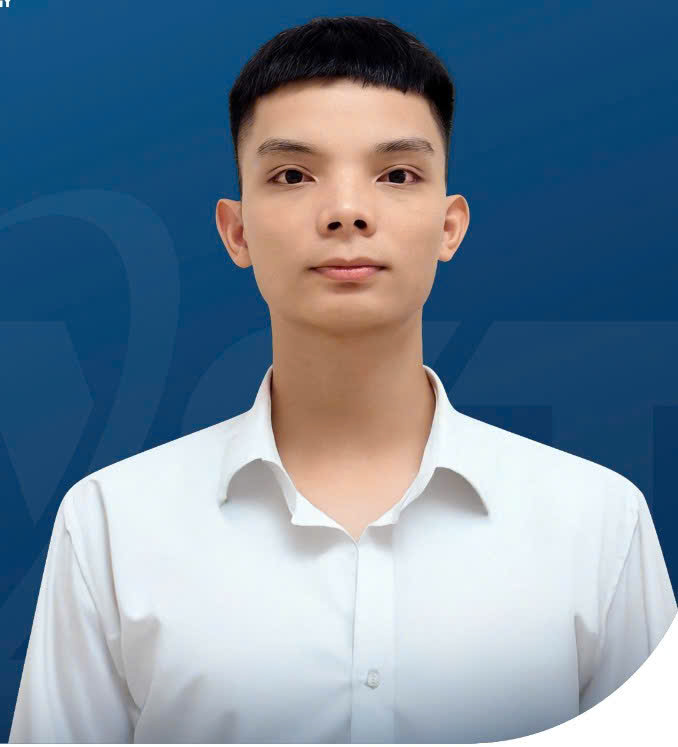
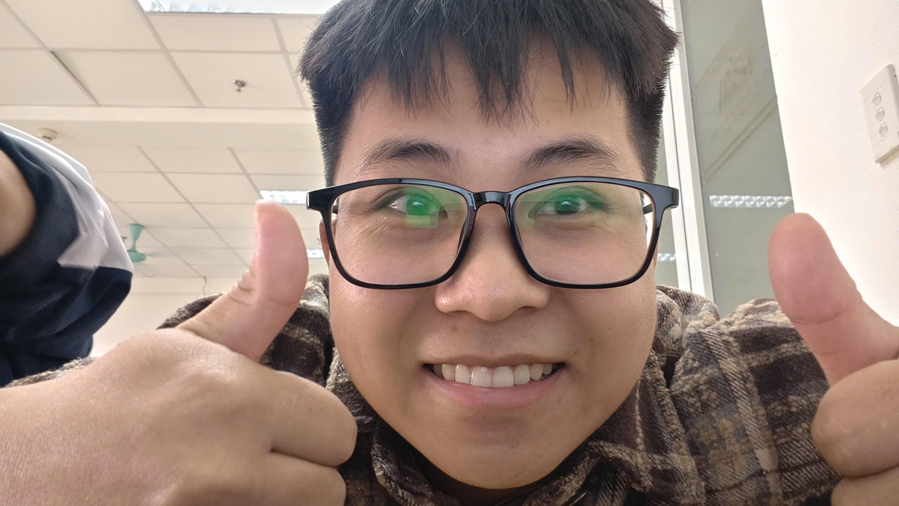
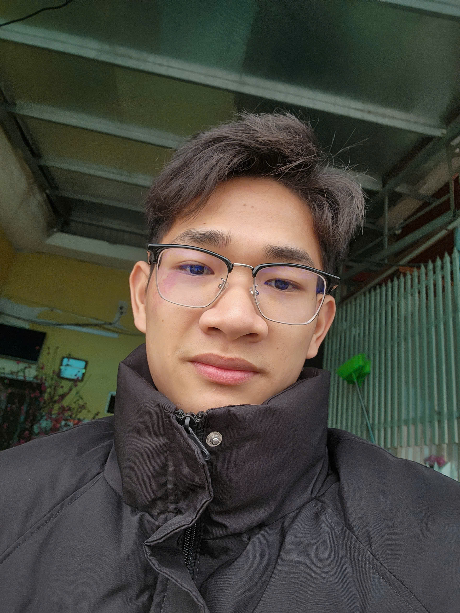

    <h1 style="margin-bottom: 10px; font-size: 2.5em;">🧠 IAI Lab</h1>
    
    

        "Weekly Research Seminar & Knowledge Sharing" 
    

## :material-hub-outline: About Us
---

Được thành lập dưới sự bảo trợ của [Institute of Artificial Intelligence (Viện Trí tuệ Nhân tạo - IAI)](https://iai.ictu.edu.vn). IAI Lab là không gian nghiên cứu. gian nghiên cứu chuyên sâu, nơi hội tụ các nghiên cứu viên tâm huyết nhằm thúc đẩy văn hóa hợp tác thay vì làm việc độc lập. Tại đây, chúng tôi duy trì các hoạt động sinh hoạt chuyên môn định kỳ hàng tuần: từ việc phân tích các công trình khoa học tiên tiến, thảo luận giải pháp cho các bài toán kỹ thuật phức tạp, đến việc chia sẻ tài nguyên tri thức. Sứ mệnh của IAI Lab là kiến tạo một môi trường học thuật cởi mở, nơi tri thức được lan tỏa và năng lực nghiên cứu của mỗi thành viên được hoàn thiện từng ngày.

## :material-account-group-outline: Members
---

- 

    ^^Nguyễn Thái Học^^

    ---
    🌴 **Team Lead / AI Reseacher**

    ==Focus:==

    - Computer Vision & Speech Processing
    - Large Language Models
    - Multimodal Learning
    - AI in Healthcare & Education

    [:octicons-home-16:](https://nthaihoc.github.io/about-me) &nbsp;&nbsp; 
    [:material-email:](mailto:thaihocit02@gmail.com) &nbsp;&nbsp; 
    [:simple-github:](https://github.com/nthaihoc) &nbsp;&nbsp; 
    [:material-school:](https://scholar.google.com/citations?user=SvS3rssAAAAJ&hl=vi) &nbsp;&nbsp;
    [:material-file-account:](../assets/files/curriculum_vitae.pdf)

-   

    ^^Sùng A Khua^^

    ---

    🌱 **AI Research Intern**

    [:octicons-home-16:](https://nthaihoc.github.io) &nbsp;&nbsp; 
    [:material-email:](sungkhua13204@gmail.com) &nbsp;&nbsp; 

-   

    ^^Vũ Ngọc Thiện^^

    ---

    🌱 **AI Research Intern**

    [:octicons-home-16:](https://nthaihoc.github.io) &nbsp;&nbsp; 
    [:material-email:](vungocthien843@gmail.com) &nbsp;&nbsp; 

-   

    ^^Trần Đặng Vương Quốc Long^^

    ---

    🌱 **AI Research Intern**

    [:octicons-home-16:](https://nthaihoc.github.io) &nbsp;&nbsp; 
    [:material-email:](mailto:thaihocit02@gmail.com) &nbsp;&nbsp; 

<!-- -   

    ^^Nguyễn Thuỳ Trang^^

    ---

    🌱 **Research Intern**

    [:octicons-home-16:](https://nthaihoc.github.io) &nbsp;&nbsp; 
    [:material-email:](mailto:thaihocit02@gmail.com) &nbsp;&nbsp;  -->

## :material-sitemap-outline: Meeting Structure
---

:material-trending-up: ==Interim Reports (Báo cáo cập nhật tiến độ).==

- **Mục tiêu:** Báo cáo tiến độ hằng tuần nhằm rà soát, kiểm tra khối lượng công việc thực tế đạt được so với kế hoạch đề ra.

- **Yêu cầu chi tiết:**

    - Kết quả công việc đã hoàn thành trong tuần, thể hiện qua các tài liệu, ghi chú và mã nguồn thực nghiệm.
    - Các vấn đề kỹ thuật và khó khăn phát sinh trong quá trình nghiên cứu.
    - Lên kế hoạch cụ thể cho tuần tiếp theo.

:material-trending-up: ==Scientific Talk (Thảo luận khoa học).==

- **Mục tiêu:** Trình bày nghiên cứu khoa học hằng tuần giúp cập nhật tri thức mới, rèn luyện kỹ năng đọc hiểu và tư duy phản biện.

- **Yêu cầu chi tiết:**

    - Mỗi tuần, một thành viên (theo lịch luân phiên) sẽ chọn và trình bày một bài báo khoa học.
    - Nội dung trình bày: Bài toán giải quyết (problem), phương pháp (method), kết quả (experiments) và Nhận xét cá nhân (review) về pros/cons (ưu/nhược điểm).
    - Các thành viên còn lại có trách nhiệm tham gia thảo luận và đặt câu hỏi phản biện.

## :octicons-location-16: Time & Location
---

!!! info "Địa điểm sinh hoạt (Venue)"
    
    

    - **🏢 Offline:**   Viện KH&CNUD - Phòng 403 - Toà nhà C6   *(Địa điểm có thể thay đổi để đảm bảo không gian làm việc luôn luôn mới mé phụ thuộc vào thành viên của nhóm)*

    - **🎥 Online:**   **[:simple-googlemeet: Google Meet Link](https://meet.google.com/ych-juck-mwh)**   *(Dành cho thành viên hoặc khách mời tham dự trực tuyến)*

    

!!! abstract "Các mốc thời gian quan trọng (Important Date)"

    | Day  | Deadline | Note |
    | :--- | :--- | :--- |
    | **Thứ 5 (hằng tuần)** | **23:59** | Thành viên chuẩn bị các tài liệu liên quan và phải upload toàn bộ tài liệu lên [**[:material-folder-google-drive: IASTLab](https://drive.google.com/drive/folders/1MEaVeBwm0gDWSt0ibtaRSTuY5EySxaum?usp=drive_link)**] (trước giờ họp 24h). |
    | **Thứ 6 (hằng tuần)** | **23:59** | Thành viên tiến hành đăng ký bài báo thuyết trình cho tuần kế tiếp để đảm bảo thời gian xét duyệt. |
    | **Thứ 7 (hằng tuần)** | **13:30 - 17:30** | :material-microphone: **Weekly Seminar** |
    
^^*:fontawesome-solid-warning: Để đảm bảo quy trình vận hành của Lab được thống nhất và chuyên nghiệp, các thành viên vui lòng ghi nhớ địa điểm sinh hoạt và các mốc deadline cố định hàng tuần.*^^

## :material-book-cog-outline: Guidelines
---

:material-script-text-outline: ==Guidelines for Progress Reporting (Hướng dẫn báo cáo tiến độ).==

- {++Step 01: Planing (Lập kế hoạch):++}

    - Mỗi thành viên phải liệt kê danh sách các đầu việc (checklist hoặc to-do list) dự kiến thực hiện cho một công việc được Team Lead giao trong tuần. 
    - Các công việc cần phải được chia nhỏ thành nhiều nhiệm vụ nhỏ, rõ ràng và đo lường được. Có thể tham khảo mẫu checklist dưới đây:

    !!! example "**FileName:** ^^Ho&Ten_Checklist_DD/MM/YY^^"

        1. Deep Research

            - [:material-check-circle:] Paper Reading: Đọc tối thiểu 2-3 papers mới liên quan trực tiếp đến công việc đang nghiên cứu.

            - [:material-check-circle:] Competitor Analysis: Kiểm tra xem có repo code mới nào giải quyết bài toán tương tự không.

            - $\ldots$

        2. Engineering & Experimentation (Thực nghiệm)

            - [:material-check-circle:] Datasets Survey (Khảo sát dữ liệu): Tìm kiếm, nghiên cứu về các bộ dữ liệu liên quan v.v.

            - [:material-check-circle:] Lựa chọn và lên các kịch bản huấn luyện mô hình.

            - [:material-check-circle:] Đánh giá và viết báo cáo kết quả v.v.

            - $\ldots$
        
        3. $\ldots$

- {++Step 02: Review (Đánh giá):++}

    - Tại buổi seminar, thành viên trình chiếu checklist/to-do list của tuần cũ đã được lập kế hoạch để rà soát và đối chiếu với công việc thực tế đạt được.

    - Tiến hành đánh dấu cho các trạng thái đầu việc: Done (hoàn thành); In Progress (đang thực hiện) và Overdue (trễ hạn).

- {++Step 03: Resolution (Đề xuất giải pháp):++}

    - Đối với các nhiệm vụ chưa hoàn thành, thành viên bắt buộc phải phân tích, giải thích rõ nguyên nhân (khách quan/chủ quan). Ví dụ: lỗi kỹ thuật phát sinh, thiếu tài nguyên tính toán, không triển khai code...

    - Đề xuất phương án khắc phục cụ thể và cam kết deadline mới cho tuần kế tiếp.

:material-script-text-outline: ==Seminar Registration Guidelines (Hướng dẫn đăng kí seminar).==

- {++Step 01: Topic Selection (Lựa chọn chủ đề):++}

    - Thành viên được lựa chọn bất kỳ chủ đề nào xoay quanh lĩnh vực AI, tuy nhiên cần ưu tiên nguồn bài báo, các công trình từ hội nghị đầu ngành (Top-tier Conferences: CVPR, ICCV, NeurIPS, ICML, ICLR, Interspeech...) hoặc tạp chí uy tín (Rank Q1/Q2). 

    - Bài báo phải có tính cập nhật hoặc là các bài báo nền tảng, là kiến thức mới đối với các thành viên.

- {++Step 02: Registration (Đăng ký chủ đề):++}

    - Thành viên điền đầy đủ thông tin bài báo (tên thành viên, tiêu đề, hội nghị, năm công bố, lĩnh vực, link PDF...) vào [**[:material-table-edit: ListPaper](https://docs.google.com/spreadsheets/d/1rLwiwSMnBNsj-SEgDYBTchc7u9wENrCx97TL6-DyzYA/edit?usp=drive_link)**].
    - Deadline: Trước **23:59** Thứ 7 hàng tuần (để đảm bảo thời gian xét duyệt).

- {++Step 03: Review & Scheduling (Phê duyệt & Xếp lịch)++}

    - Team Lead (hoặc tất cả các thành viên trong nhóm) sẽ xem xét tính phù hợp của bài báo mà thành viên đã đăng ký.
    - Sau khi được phê duyệt, lịch trình bày của tất cả thành viên sẽ được điều chỉnh và cập nhật lên lịch chung của nhóm [**[:material-calendar-month: Calendar View](#scheduler-section)**].

- {++Step 04: Preparation Protocol (Công tác chuẩn bị)++}

    - Thành viên chủ động nghiên cứu, chuẩn bị nội dung trình bày. Toàn bộ tài liệu liên quan phải được upload lên [**[:material-folder-google-drive: IASTLab](https://drive.google.com/drive/folders/1MEaVeBwm0gDWSt0ibtaRSTuY5EySxaum?usp=drive_link)**] trước buổi thảo luận 24 giờ.
    - Các thành viên còn lại có trách nhiệm đọc trước tài liệu và chuẩn bị câu hỏi phản biện.

^^*:fontawesome-solid-warning: Hằng tuần các thành viên trong nhóm có trách nhiệm báo cáo tiến độ và đăng kí tối thiểu 1 nội dung seminar.*^^

## :material-calendar-outline: Scheduler {: #scheduler-section }
---

=== "Calendar View"

    

        <iframe src="https://calendar.google.com/calendar/embed?src=thaihocit02%40gmail.com&ctz=Asia%2FHo_Chi_Minh" style="border: 0" width="100%" height="600" frameborder="0" scrolling="no"></iframe>
    

=== "Weekly Seminar"

    <!-- | Date | Speaker | Topic | Status |
    | :--- | :------ | :---- | :----: |
    | 13/12/2025 | **Nguyễn Thái Học** | Overview for Large Language Models (LLMs) and Attention Is All You Need | :material-clock-outline: ==Upcoming== |
    |  | **Sùng A Khua** | Very Deep Convolutional Networks for Lagre-Scale Image Recognition (VGG19) | :material-clock-outline: ==Upcoming== |
    |  | **Vũ Ngọc Thiện** | Very Deep Convolutional Networks for Lagre-Scale Image Recognition (VGG16) | :material-clock-outline: ==Upcoming== |
    |  | **Trần Đặng V.Q Long** | MobileNets: Efficient Convolutional Neural Networks for Mobile Vision Applications | :material-clock-outline: ==Upcoming== | -->

## :material-database-outline: Resources
---

### :material-link-plus: Quick Links

Cổng truy cập nhanh các tài nguyên số, kho dữ liệu dùng chung và phòng họp trực tuyến của IAST Lab:

-   :material-folder-google-drive: **IAST Storage**
    
    ---
    [:octicons-arrow-right-24: View](https://drive.google.com/drive/folders/1MEaVeBwm0gDWSt0ibtaRSTuY5EySxaum?usp=drive_link)

-   :simple-googlemeet: **Meeting Room**
    
    ---
    [:octicons-arrow-right-24: View](https://meet.google.com/ych-juck-mwh)

-   :material-table-edit: **Paper List**
    
    ---
    [:octicons-arrow-right-24: View](https://docs.google.com/spreadsheets/d/1rLwiwSMnBNsj-SEgDYBTchc7u9wENrCx97TL6-DyzYA/edit?usp=drive_link)

-   :octicons-mark-github-16: **Source Code**
    
    ---
    [:octicons-arrow-right-24: View](#)

---