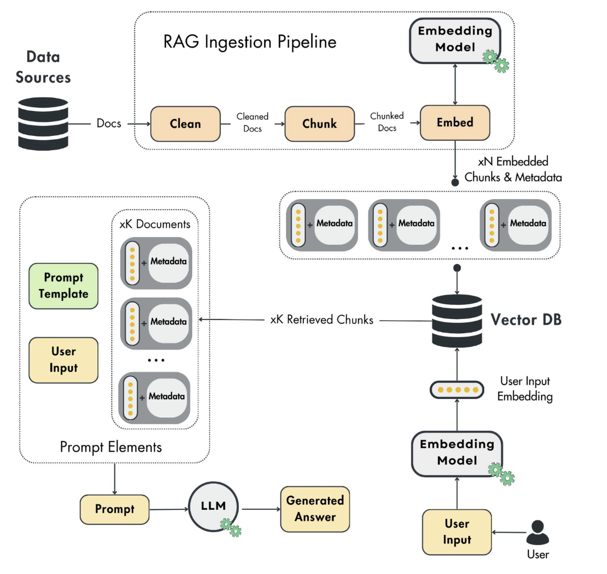

<center markdown># Lecture 01. Vallina RAG</center>

## 1. Brief
---
RAG (Retrieval Augmented Generation) là kỹ thuật nền tảng của các ứng dụng AI tạo sinh. Nhiệm vụ chính là đưa các dữ liệu tuỳ chỉnh (dữ liệu nội bộ, dữ liệu riêng tư hoặc dữ liệu mới cập nhật) vào mô hình ngôn ngữ lớn để chúng có thể tóm tắt, xử lý hoặc trích xuất thông tin. Vì việc huấn luyện lại (fine-tuning) một mô hình AI tốn rất nhiều thời gian và chi phí. RAG mang đến giải pháp tối ưu giúp AI có thể truy cập và sử dụng dữ liệu mới mà không phải học lại từ đầu.
    
RAG nâng cao độ chính xác và tính tin cậy của các mô hình AI tạo sinh bằng thông tin được lấy từ các nguồn bên ngoài. Đây là một kỹ thuật bổ trợ cho kiến thức nội tại của các mô hình LLMs. RAG là viết tắt của:

- **Retrieval (Truy xuất):** Tìm kiếm các dữ liệu có liên quan.

- **Augumented (Tăng cường):** Thêm dữ liệu đó làm ngữ cảnh vào câu lệnh (prompt) của người dùng.

- **Generation (Tạo sinh):** Sử dụng câu lệnh đã được tăng cường đó cùng với LLM để tạo câu trả lời.

Bất kỳ LLM nào cũng bị giới hạn trong việc chỉ hiểu những dữ liệu mà nó đã được huấn luyện, đôi khi được gọi là kiến thức tham số hóa (parameterized knowledge). Do đó, ngay cả khi LLM có thể trả lời hoàn hảo những gì đã xảy ra trong quá khứ, nó sẽ không có quyền truy cập vào các dữ liệu mới nhất hoặc bất kỳ nguồn thông tin bên ngoài nào khác mà nó chưa từng được học.

RAG ra đời để khắc phục các hạn chế lớn này của LLM. Kỹ thuật này cung cấp quyền truy cập vào các dữ liệu bên ngoài hoặc dữ liệu mới nhất và ngăn chặn hiện tượng ảo giác (hallucinate), từ đó giúp nâng cao độ chính xác và độ tin cậy của các mô hình AI tạo sinh.

## 2. RAG Architecture
---
Một hệ thống RAG cơ bản gồm 3 module chính hoạt động độc lập với nhau:

- **Ingestion pipeline.** Một đường ống xử lý theo batch hoặc stream được sử dụng để nạp dữ liệu vào cơ sở dữ liệu vector (vector DB).

- **Retrieval pipeline.** Một module truy vấn vector DB và trích xuất các mục liêun quan đến đầu vào của người dùng.

- **Generation pipeline.** Lớp sử dụng dữ liệu được truy xuất để bổ sung vào prompt, và dùng một mô hình LLM tạo ra các câu trả lời.

<div class="figure-environment">
    <div class="subfigure-container"> <figure class="subfigure">
            
        </figure>
    </div>
</div>

</center> 
/// caption
**Hình 1:** Vanilla RAG architecture.
/// 
</center>

### 2.1 Ingestion pipeline
---
Đây là gian đoạn đầu tiên và rất quan trọng của RAG, giai đoạn này tạo ra các đường ống để trích xuất các tài liệu thô  từ nhiều nguồn dữ liệu khác nhau (web, api, database...). Sau đó, chúng làm sạch, phân mảnh (chia thành các phần nhỏ hơn) và nhúng (embedding) các tài liệu này. Cuối cùng, đưa những tài liệu đã đơcj phân mảnh này vào một cơ sở dữ liệu vector. Giai đoạn này được cấu thành từ nhiều module nhỏ:

- **Data extraction.** Thu thập tất cả các dữ liệu cần thiết từ nhiều nguồn khác nhau. Module này phụ thuộc rất nhiều vào dữ liệu. 

- **Cleaning layer.** Chuẩn hóa và loại bỏ các ký tự không mong muốn khỏi dữ liệu vừa được trích xuất. Ví dụ loại bỏ các ký tự không thuộc bảng mã ASCII, hoặc ký tự định dạng in đậm, in nghiêng. Các chiến lược làm sạch sẽ thay đổi tuỳ thuộc vào nguồn dữ liệu và mô hình nhúng mà chúng ta sử dụng.

- **Chunking.** Chia tài liệu đã được làm sạch thành các phần nhỏ hơn. Bước này là bắt buộc để đảm bảo nội dung không vượt qua kích thước đầu vào tối đa của mô hình trong quá trình nhúng (embedding). Ngoài ra, việc phân mảnh là cần thiết để cô lập các vùng thông tin cụ thể có liên quan về mặt ngữ nghĩa. Ví dụ, khi phân mảnh một chương sách, cách tối ưu nhất là nhóm các doạn văn có nội dung tương tự vào cùng một phần. Bằng cách này, tại thời điểm truy xuất, chúng ta sẽ chỉ thêm những dữ liệu cần thiết vào prompt.

- **Embedding component.** Sử dụng một mô hình nhứng để ánh xạ nội dung phân mảnh dữ liệu thành một vector dạng đặc chứa các giá trị ngữ nghĩa.

- **Loading.** Nhận các phân mảnh đã được nhúng cùng với một siêu dữ liệu (metadata). Siêu dữ liệu này chứa các thông tin quan trọng như: bản text gốc của nội dung được nhúng, URL dẫn đến nguồn của phân mảnh đó v.v. Các vector nhúng được sử dụng như một chỉ mục để tìm kiém các phân mảnh tương tự, trong khi siêu dữ liệu được dùng để truy xuất thông tin gốc dạng văn bản nhằm bổ sung vào prompt cho LLM.

### 2.2 Retrieval pipeline
---
Chức năng chính của bước truy xuất này là ánh xạ đầu vào của người dùng (văn bản, hình ảnh, âm thanh,v.v.) vào cùng một không gian vector với các embedding được sử dụng làm chỉ mục trong vector DB.  Điều này cho phép chúng tìm được $k$ mục có độ tương đồng cao nhất (top $k$) bằng cách so sánh các embedding từ kho lưu trữ vector với đầu vào của người dùng. Các mục này sau đó đóng vai trò là nội dung để bổ sung vào prompt, truyền cho LLM nhằm tạo ra câu trả lời.

Thước đo được sử dụng để so sánh hai vector có thể là Euclidean hoặc Manhattan. Nhưng phổ biến nhất là thuớc đo Cosine, với giá trị bằng -1 thì vector A và B ngược chiều nhau, bằng 0 nếu chúng vuông góc, bằng 1 nếu cùng chiều.

$$
\text{cosine} = 1 - \frac{A \cdot B}{\|A\| \cdot \|B\|}
$$

Một lưu ý quan trọng là, đầu vào của người dùng và các embedding trong DB phải nằm trong cùng một không gian vector. Chúng ta cần làm sạch, phân mảnh và nhúng đầu vào của người dùng bằng các hàm, mô hình và siêu tham số giống hết với các dữ liệu thô được xử lý và lưu trữ trong DB trước đó.

### 2.3 Generation pipeline
---
Bước cuối cùng của hệ thống RAG là tiếp nhận đầu vào của người dùng, lấy dữ liệu đã truy xuất được, chuyển tất cả chúng đến một LLM và tạo ra một câu trả lời có giá trị. Prompt (lời nhắc) cuối cùng là kết quả của một cấu trúc bao gồm **system_template** (mẫu hệ thống) và **prompt_template** (mẫu lời nhắc) được lấp đầy bằng câu hỏi của người dùng kèm theo ngữ cảnh được trưy xuất. Có rất nhiều mẫu prompt khác nhau, tuỳ thuộc vào từng ứng dụng. Thông thường, thì mẫu prompt dưới đây thường được sử dụng.

```python linenums="1" hl_lines="1-3 5-11"
system_template = """
Bạn là một trợ lý hữu ích, luôn trả lời tất cả các câu hỏi của người dùng một cách lịch sự.
"""

prompt_template = """
Hãy trả lời câu hỏi của người dùng chỉ bằng cách sử dụng ngữ cảnh được cung cấp dưới đây. 
Nếu bạn không thể trả lời dựa vào ngữ cảnh này, hãy phản hồi bằng câu "Tôi không biết."

Ngữ cảnh: {context}
Câu hỏi của người dùng: {user_question}
"""

user_question = "<câu_hỏi_của_user>"

# Bước truy xuất dữ liệu từ Vector DB dựa trên câu hỏi
retrieved_context = retrieve(user_question) 

# Hợp nhất các mẫu cấu trúc lại thành một Prompt hoàn chỉnh
prompt = f"{system_template}\n"
prompt += prompt_template.format(context=retrieved_context, user_question=user_question)

# Gửi Prompt hoàn chỉnh này đến LLM để nhận câu trả lời
answer = llm(prompt)
```

Khi các mẫu prompt này phát triển và thay đổi theo thời gian, mỗi sự thay đổi đều nên được theo dõi và quản lý phiên bản bằng cách áp dụng các công cụ như Git, hoặc lưu trữ các mẫu prompt trong database hay là sử dụng công cụ quản lý prompt chuyên nghiệp như **`LangFuse`**.

### 2.4 Recap Embeddings
---
Máy tính chỉ hiểu những con số. Do đó, **Embeddings** đóng vai trò là "người phiên dịch", chuyển đổi các dữ liệu phi cấu trúc (văn bản, hình ảnh, âm thanh) thành các vector. Về mặt lý thuyết, Embeddings là các biểu diễn số học dạng đặc (dense) của đối tượng, được mã hoá thành các vector trong một không gian liên tục.

Mô hình AI chỉ làm việc với số, do đó việc chuyển đổi này giúp mô hình dễ dàng hiểu và xử lý thông tin. So với các kỹ thuật mã hóa truyền thống, Embeddings giải quyết được nhiều hạn chế cốt lõi:

| Phương pháp | Cơ chế hoạt động | Ghi chú |
| :--- | :--- | :--- |
| **One-hot encoding** | Chuyển đổi mỗi từ thành một mảng gồm toàn số 0 và 1. | **Nhược điểm:** Gây ra "lời nguyền số chiều". Số lượng từ vựng lớn $\rightarrow$ vector khổng lồ $\rightarrow$ tốn tài nguyên tính toán. |
| **Feature hashing** | Dùng hàm băm (hash) để ánh xạ từ vào các nhóm cố định. | **Nhược điểm:** Dễ bị trùng lặp (collision) và không giữ được mối quan hệ ngữ nghĩa giữa các từ. |
| **Embeddings** | Nén thông tin vào một vector kích thước nhỏ, dày đặc. | **Ưu điểm:** Giữ nguyên được ý nghĩa và mối quan hệ ngữ cảnh, kiểm soát chặt chẽ số lượng chiều đầu ra. |

Trước khi cơn sốt RAG và AI tạo sinh bùng nổ, khái niệm nhúng dữ liệu này vốn dĩ đã là nền tảng cho rất nhiều hệ thống cốt lõi:

- Đại diện cho các biến phân loại (categorical variables) trong ML/DL truyền thống.

- Hệ thống đề xuất (recommender systems) tìm sự liên quan giữa người dùng và sản phẩm.

- Phân cụm (clustering) và phát hiện bất thường.

- Phân loại trực tiếp hoặc zero-shot (chọn kết quả có độ tương đồng cao nhất mà không cần huấn luyện lại).

Embeddings được tạo ra bởi các mô hình học sâu (Deep Learning). Các mô hình này hiểu được ngữ cảnh của dữ liệu đầu vào và phóng chiếu chúng vào không gian vector. Tùy thuộc vào loại dữ liệu, ta sẽ chọn kiến trúc phù hợp:

- **Văn bản:** Sử dụng các phương pháp dựa trên kiến trúc **Transformer** như **BERT** hoặc **RoBERTa**. Trong thực hành với `python`, bạn có thể sử dụng thư viện `sentence-transformers` của hệ sinh thái `Hugging Face` để tính toán rất nhanh gọn.

- **Hình ảnh:** Cần sử dụng các mạng chập **CNNs**, tiêu biểu như kiến trúc **ResNet**. 

- **Âm thanh:** Sử dụng các mô hình chuyên biệt để trích xuất đặc trưng như **Wav2Vec2** hoặc **Whisper**.

- **Đa phương tiện (Multimodal):** Nếu muốn tính khoảng cách chéo giữa hai loại dữ liệu (ví dụ: dùng văn bản để tìm hình ảnh), cần các mô hình được thiết kế để phóng chiếu cả hai vào chung một không gian vector như **CLIP** hoặc **BLIP**.

Để tra cứu và chọn các mô hình nhúng văn bản tốt nhất cho dự án, bạn có thể tham khảo bảng xếp hạng **MTEB** (Massive Text Embedding Benchmark) trên Hugging Face.

### 2.5 Vector DB
---

^^More on vector DBs:^^ **Vector DBs** được thiết kế chuyên biệt để lưu trữ, lập chỉ mục và truy xuất các vector embeddings một cách hiệu quả. Khác với các cơ sở dữ liệu truyển thống (chỉ lưu trữ dạng vô hướng/scalar) và gặp khó khăn với độ phức tạp của dữ liệu vector. Do đó, Vector DB trơ nên mang tính sống còn đối với các tác vụ như tìm kiếm ngữ nghĩa theo thời gian thực.

Hiện nay có rất nhiều các thư viện hỗ trợ việc lập chỉ mục vector như `FAISS`, rất hiệu quả trong việc tìm kiếm độ tương đồng, nhưng chúng thiếu các tính năng quản lý dữ liệu toàn diện. Vector DB hỗ trợ các thao tác CRUD (tạo, đọc, sửa, xoá), lọc theo siêu dữ liệu, khả năng mở rộng, cập nhật thời gian thực, sao lưu, tích hợp hệ sinh thái và bảo mật dữ liệu mạnh mẽ. Điều này biến chúng trở thành công cụ hàng đầu cho triển khai các ứng dụng thực tế.

^^Vector DB work:^^ Thông thường khi thực hiện truy xuất dữ liệu trên DB truyển thống, chúng ta thường sử dụng một câu lệnh bất kì và hệ thống sẽ trả về kết quả khớp chính xác tuyệt đối (extract match). Vector DB thì khác, thay vì tìm sự trùng khớp hoàn hảo, chúng tìm kiếm những vector gần nhất so với vector truy vấn bằng cách sử dụng các thuật toán **ANN** (Approximate Nearest Neighbor - Láng giềng gần nhất xấp xỉ).

Mặc dù các thuật toán ANN không trả về chính xác 100% giá trị cho một tìm kiếm, nhưng các thuật toán tìm kiếm chính xác tuyệt đối thường quá chậm để áp dụng trong thực tế. Các nghiên cứu đã chỉ ra việc dùng xấp xỉ các kết quả tốt nhất là đủ hiệu quả. Quy trình hoạt động có thể tóm gọn thành ba bước chính:

- **Indexing.** Các vector được lập chỉ mục bằng cấu trúc dữ liệu tối ưu cho không gian chiều cao. Các kỹ thuật phổ biến như **HNSW**, **Random projection**, **PQ** và **LSH**.

- **Querying.** Hệ thống so sánh vector đầu vào với các vector đã lưu để tìm ra kết quả tương đồng nhất.

- **Post-processing.** Tinh chỉnh lại kết quả để đảm bảo trả về các vector liên quan nhất cho người dùng.

Vector DB có thể lọc kết quả dựa trên các thông tin phụ. Việc lọc này có thể diễn ra trước hoặc sau khi tìm kiếm vector, mỗi cách đều có ưu/nhược điểm riêng về hiệu suất.

^^Algorithms for creating vector index.^^ Để truy xuất nhanh trong hàng triệu vector, Vector DB không duyệt qua từng cái một mà dùng các thuật toán thông minh để gom nhóm hoặc thu gọn dữ liệu.

| Thuật toán | Cơ chế | Giải thích |
| :--------- | :----- | :--------- |
| **Random Projection** | Dùng ma trận ngẫu nhiên để chiếu vector từ số chiều cao xuống thấp hơn nhưng vẫn giữ khoảng cách tương đối | Giống như việc chụp ảnh cái bóng 2D của một vật thể 3D. Dữ liệu nhẹ đi nhưng vẫn có thể hình dung ra được hình dáng của chúng. |
| **PQ** (Product Quantization) | Chia vector dài thành các phần nhỏ hơn, sau đó nén chúng lại thành các mã đại diện | Một bức ảnh độ phân giải cực cao được nén lại thành ảnh chất lượng thấp hơn bằng cách gom các pixel màu giống nhau lại |
| **LSH** (Locality-sensitive hashing) | Dùng hàm băm để ném các vector có độ tương đồng cao vào chung một nhóm | Hệ thống sẽ cố gắng băm các vật giống nhau vào chung một chỗ dể khi tìm kiếm chúng chỉ cần lấy một giá trị trong thùng thay vì cả kho. |
| **HNSW** (Hierarchical Navigable Small World) | Xây dựng đồ thị nhiều tầng, các tầng trên cùng rất thưa thớt (để sàng lọc nhanh), các tầng dưới cùng chi tiết hơn (đề tìm chính xác) | Giống như việc tìm kiếm đường trên Google Maps. Đầu tiên thu nhỏ để đi đến đường cao tốc nối các thành phố (tầng trên), khi đến nơi mới phóng to để tìm đường trong hẻm (tầng dưới). Hiện tại đây là thuật toán SOTA nhất. |

^^DB operations.^^ Vector DBs có nhiều điểm chung giống với các database truyển thống đảm bảo hiệu suất cao, khả năng chịu lỗi và dễ dàng quản lý trong môi trường thực tế.

- **Sharding & Replication.** Dữ liệu được chia nhỏ trên nhiều máy chủ khác nhau, đảm bảo khả năng mở rộng. Đồng thời cũng được nhân bản, để nếu một máy chủ chết, hệ thống vẫn hoạt động bình thường.

- **Monitoring.** Theo dõi liên tục độ trễ truy vấn, RAM, CPU và ổ cứng để ngăn chặn sự cố.

- **Access control.** Phân quyền và các giao thức bảo mật để bảo vệ thông tin nhạy cảm.

- **Backups.** Sao lưu tự động thường xuyên để có thể khôi phục dữ liệu, nếu hệ thống bị hỏng.

## 3. Advanced RAG
### 3.1 Nhược điểm của vanilla RAG
---
Khung RAG được trình bày trong [vanilla-rag](#i-vanilla-rag) không giải quyết được các vấn đề nền tảng có ảnh hưởng đến chất lượng truy xuất và sinh câu trả lời ở một số khía cạnh như:

- Các tài liệu được truy xuất có liên quan đến câu hỏi của người dùng không?

- Ngữ cảnh được truy xuất có đủ để trả lời câu hỏi của người dùng không?

- Có thông tin dư thừa nào chỉ tăng thêm độ nhiễu cho prompt được bổ sung không?

- Độ trễ của bước truy xuất có đáp ứng được yêu cầu của người dùng?

- Cần phải làm gì nếu không thể tạo ra một câu trả lời hợp lệ bằng thông tin đã truy xuất.

Từ những vấn đề này, có thể nhận thấy rằng cần phải có một module đánh giá mạnh mẽ cho hệ thống RAG, có khả năng định lượng và đo lường được chất lượng của dữ liệu được truy xuất cũng như câu trả lời được tạo ra so với câu hỏi của người dùng. Bên cạnh đó, cần cải tiến khung RAG để giải quyết trực tiếp các hạn chế truy xuất ngay trong thuật toán. 

Do đó, hệ thống RAG nâng cao có thể được tối ưu hoá ở ba giai đoạn khác nhau:

- **Pre-retrieval.** Tập trung vào cấu trúc và tiền xử lý dữ liệu nhằm tối ưu hoá việc lập chỉ mục cũng như tối ưu hoá câu truy vấn.

- **Retrieval.** Xoay quanh việc cải thiện các mô hình nhúng, lọc siêu dữ liệu để cải thiện tìm kiếm vector.

- **Post-retrieval.** Lọc bỏ nhiễu khỏi các tài liệu được truy xuất, nén prompt truóc khi đưa vào LLM sinh câu trả lời.

### 3.2 Pre-retrieval
---
Các bước tiền truy xuất được thực hiện theo hai hướng:

- **Data indexing.** Luồng nạp dữ liệu RAG, chủ yếu được triển khai trong các module làm sạch hoặc phân mảnh để tiền xử lý dữ liệu giúp việc lập chỉ mục tốt hơn.

- **Query optimization.** Thuật toán được thực hiện trực tiếp trên câu truy vấn của người dùng trước khi nhúng và truy xuất các phân mảnh từ cơ sở dữ liệu vector.

^^Data indexing.^^ Đối với việc lập chỉ mục bằng các vector nhúng, hầu hết các kỹ thuật tập trung vào việc tiền xử lý và cấu trúc dữ liệu tốt hơn để cải thiện truy xuất, chẳng hạn như:

- **Sliding window.** Kỹ thuật cửa sổ trượt tạo ra sự chồng chéo giữa các phân mảnh văn bản, đảm bảo ngữ cảnh quan trọng gần ranh giới giữa các phân mảnh được giữa giữ lại, tăng cường độ chính xác khi truy xuất. Kỹ thuật này thường có lợi trong lĩnh vực như tài liệu pháp lý, bài báo khoa học, hồ sơ y tế, nơi thông tin quan trọng thường kéo dài qua nhiều phần.

- **Enhancing data granularity.** Kỹ thuật nhằm tăng cường độ chi tiết của dữ liệu bằng việc làm sạch, loại bỏ các chi tiết không liên quan, xác minh và cập nhật các thông tin lỗi thời. Một tập dữ liệu sạch và chính xác cho phép truy xuất sắc bén hơn.

- **Metadata.** Thêm các trường như URL, ID, ngày tháng bên ngoài hoặc đánh dấu chương, phần giúp lọc kết quả hiệu quả trong quá trình truy xuất.

- **Optimizing index structures.** Dựa trên các phương pháp chỉ mục dữ liệu khác nhau, chẳng hạn như kích thước phân mảnh đa dạng và các chiến lược đa chỉ mục.

- **Small-to-big.** Thuật tóan tách biệt các phân mảnh được dùng để truy xuất và ngữ cảnh được đưa vào prompt để sinh câu trả lời cuối cùng. Thuật toán dùng một đoạn văn bản nhỏ để tính toán vector nhúng, đồng thời lưu giữ đoạn văn bản đó cùng với một cửa sổ rộng hơn xung quanh nó trong siêu dữ liệu. Nhờ đó, việc dùng các phân mảnh nhỏ giúp tăng dộ chính xác khi truy xuất, trong khi ngữ cảnh lớn cung cấp nhiều thông tin cho LLM. 

^^Query optimization.^^ Về mặt tối ưu hoá truy vấn, có thể tận dụng các kỹ thuật định tuyến truy vấn, viết lại truy vấn và mở rộng truy vấn để tinh chỉnh thêm thông tin truy xuất cho LLM:

- **Query routing.** Dựa trên câu hỏi của user, hệ thống có thể phải tương tác với nhiều loại dữ liệu khác nhau và truy vấn từng danh mục theo nhiều cách khác nhau. Kỹ thuật này dược dùng để quyết định hành động nào cần thực hiện dựa trên đầu vào, tương tự như câu lệnh `if-else`. Tuy nhiên, các quyết định này được đưa ra bằng ngôn ngữ tự nhiên thay vì câu lệnh logic.

- **Query rewriting.** Câu hỏi ban đầu của user có thể không khớp hoàn hảo với cách dữ liệu hệ thống được xử lý. Kỹ thuật này giải quyết vấn đề bằng cách định dạng lại câu hỏi để khớp tốt hơn với thông tin đã được lập chỉ mục như diễn giải lại, thay thế từ đồng nghĩa, chia nhỏ thành nhiều truy vấn con và cho LLM đưa ra câu trả giả định truóc cho câu hỏi sau đó cả câu hỏi gốc và giả định được đưa vào truy xuất.

- **Query expansion.** Làm phong phú câu hỏi bằng cách thêm các kỹ thuật hoặc khái niệm bổ sung, tạo ra các góc nhìn khác nhau cho cùng một câu hỏi.

- **Self-query.** Ánh xạ các truy vấn phi cấu trúc thành có cấu trúc. LLM xác định các thực thể, sự kiện và mối quan hệ quan trọng. Những yếu tố này dùng làm tham số lọc để thu hẹp không gian tìm kiếm vector. 

### 3.3 Retrieval
---

Tương tự như [pre-retrieval](#2-pre-retrieval) thì truy xuất cũng được tối ưu hoá theo hai hướng cơ bản:

- **Embedding models.** Cải thiện các mô hình nhúng được sử dụng trong quá trình mã hoá các tài liệu đã phân mảnh và tại thời điểm suy luận (lúc người dùng đặt câu hỏi), để biến đổi đầu vào của người dùng.

- **Database filter and search features.** Tận dụng các tính năng lọc và tìm kiếm database. Bước này chỉ sử dụng tại thời điểm suy luận khi phải truy xuất các phân mảnh tương đồng nhất dựa trên đầu vào của user.

Khi cải thiện các mô hình nhúng, thông thường ta phải fine-tune các mô hình nhúng đã được huấn luyện sẵn để điều chỉnh sao cho phù hợp với thuật ngữ chuyên nghành và sắc thái riêng trong lĩnh vực, đặc biệt đối với các lĩnh vực có thuật ngữ liên tục thay đổi hoặc từ ngữ hiếm gặp.

Tuy nhiên việc fine-tune một mô hình tiêu tốn rất nhiều tài nguyên tính toán và nhân lực. Thay vào đó, có thể tận dụng các mô hình hướng dẫn để dẫn dắt quá trình tạo vector nhúng bằng prompt nhắm vào từng lĩnh vực cụ thể. Có một số kỹ thuật cải thiện việc truy xuất bằng cách tận dụng các tính năng lọc và tìm kiếm cổ điển của database như:

- **Hybrid search.** Đây là sự pha trộn tìm kiếm dựa trên vector và từ khoá. Vì tìm kiếm dựa trên từ khoá rất xuất sắc trong việc xác định các tài liệu chứa từ khoá cụ thể khi mà tác vụ đòi hỏi độ chính xác tuyệt đối. Tìm kiếm vector tuy mạnh mẽ nhưng có thể khó khăn trong việc tìm kiếm các kết quả khớp chính xác, bù lại thì lại rất tốt trong việc tìm kiếm những điểm tương đồng ngữ nghĩa và tổng quát hơn. Phương pháp này sẽ được xây dựng trên hai luồng độc lập này sau đó được chuẩn hoá và hợp nhất.

- **Filtered vector search.** Phương pháp tìm kiếm này tận dụng chỉ mục siêu dữ liệu để lọc các từ khoá cụ thể bên trong siêu dữ liệu. Khác với tìm kiếm lai chúng chạy song song hai thuật toán ngữ nghĩa rồi gộp lại, phương pháp này chỉ thực hiện truy xuất vector một lần duy nhất, nhưng thêm các điều kiện lọc (có thể trước và sau quá trình truy xuất vector) nhằm gạt bỏ các kết quả không thoả mãn điều kiện, giúp LLM tập trung vào đúng phần dữ liệu mong muốn.

### 3.4 Post-retrieval
---
Cách tối ưu hoá hậu truy xuất được thực hiện duy nhất trên dữ liệu đã được truy xuất nhằm đảm bảo hiệu suất của LLM không bị suy giảm bởi các vấn đề như cửa sổ ngữ cảnh bị giới hạn hoặc dữ liệu nhiễu. Tương tự như hai giai đoạn [pre-retrieval](#2-pre-retrieval) và [retrieval](#3-retrieval), post-retrieval cũng có hai phương pháp phổ biến:

- **Prompt compression.** Loại bỏ các chi tiết không cần thiết trong khi vẫn giữ lại tinh hoa của dữ liệu.

- **Re-ranking.** Sử dụng một mô hình dạng mã hoá chéo, để chấm điểm múc độ khớp giữa đầu vào của user và chunk đã được truy xuất. Các mục được truy xuất sẽ được sắp xếp dựa trên điểm số này. Chỉ có top N kết quả tốt nhất được giữ lại làm dữ liệu liên quan nhất.

Tất cả các kỹ thuật được đề cập ở phía trên đểu không phải là danh sách đầy đủ tất cả các giải pháp tiềm năng. Đây chỉ là những ví dụ để có cái nhìn trực giác về những gì mà chúng ta có thể hoặc nên tối ưu trong toàn bộ pipeline RAG. Các kỹ thuật này thay đổi rất nhiều tuỳ thuộc vào từng loại dữ liệu. Các kỹ thuật phía trê sẽ không hoạt động nếu như làm việc với dữ liệu đa phương thức vì chúng chỉ được thiết kế cho văn bản.

---

---

<!-- <div class="figure-environment">
    <div class="subfigure-container"> <figure class="subfigure">
            
        </figure>
    </div>
</div> -->
---
