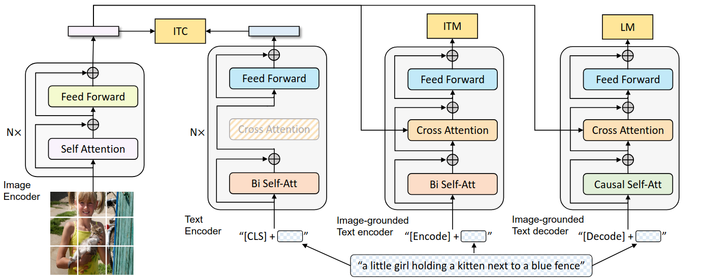

# :material-note-edit-outline: Vision Language Model - VLM
---

## Nội dung

- [**I. Mô hình CLIP**](#i-clip-model)
- [**IV. Mô hình BLIP**](#ii-blip-model)

---

## I. Mô hình CLIP
==**1. Overview**==

**Information:** The CLIP model was introduced in Jan, 2020 by OpenAI with paper title {++"Learning Transferable Visual Models from Natural Language Supervision"++}. This is a highlight architecture in combining language and image learning, opening up zero-shot learning for a wide range of computer vision tasks.

**Objectives of Model:** 

- Training the model to predict which caption matches which image on a dataset of 400 million pair (image, text), developed an efficient image representation learning model from scratch. 

- Then the training, can use natural language to refer to or describe visual concepts, allowing zero-shot transfer to a variety of tasks.

**Results achieved:** The model was evaluated on more than 30 datasets: character recognition, video action, geolocation and fine-grained object classification. Model performed competitively with supervised training methods, accuracy comparable to ResNet-50 on ImageNet without using its training set.

==**2. Architecture model**==

<figure markdown="span">
    {width=100%}
</figure>

**Image encoder:** Use ResNet50, ResNetD and ViT as the base architecture for the image encoder. Replace the GAP layer with an attention pooling mechanism - transformer style (multi-head QKV). 

**Text encoder:** 

- Transformer with the architecture modifications: 63M-parameter, 12-layer 512-wide model with 8 attention heads. 

- Text converted to token by BPE with a 49.152 vocab size and sequence length at 76.

**Multi-model embedding space:** Both image feature and text feature are layer normalized, then linearly projected into the multi-model embedding space to calculate the similarity between images and descriptions.

==**3. Zero-shot transfer**==

^^Progress:^^

1. Use image encoder to get image embedding, use text encoder to get embeddings for all class names.
2. CLIP computes cosine similarities between the image and text embeddings, scales them by a temperature parameter, then applies softmax to get probabilities. This works like a softmax classifier where both the inputs and class embeddings are L2-normalized, there's no bias term, and temperature controls the sharpness of the output. 

^^Multinomial logistic regression classifier:^^

$$\text{logit}_{i} = f_\text{img} \cdot f_\text{text, i}$$

where:

- $f_\text{img}$ is embedding image / inputs
- $f_\text{text, i}$ is embedding of text $i$ / weights
- $\text{logit}_{i}$ is cosine similarity. 

Devide the logits by a temperature ($\tau$) coefficient. Then pass it through softmax to get the classification probabilities.

$$P_{i} = \frac{e^{logit_i / \tau}}{\sum_{j}e^{logit_j / \tau}}$$

==**3. Evaluation zero-shot CLIP**==

**Objectives:** The main goal is to evaluate the quality of the representation learned by CLIP during its large-scale pre-training.

**More specifically:**

- {++Logistic Regression = Supervised baseline:++}
    - Logistic Regression is trained features extracted from a standard backbone (ResNet50, v.v), using labeled training.
    - It represents a simple and standard supervised learning baseline, commonly used to evaluate learned representations. 
- {++CLIP zero-shot = No training on the new datasets:++}
    - CLIP doesn't require fine-tuning or labels from the new dataset.
    - It simply matches image features with text embedding using cosine similarity.
    - Predictions is done directly using ís knowledge CLIP learned during pre-training.

==**4. Limitations**==

CLIP also struggles on some tasks, especially:

- Fine-grained classification, like telling apart car models, flower species, or airplane types.
- Abstract or systematic tasks, like counting objects in an image.
- New or uncommon tasks that probably weren't in CLIP's training set. 

## II. Mô hình BLIP
==**1. Tổng quan**==

**Information:** BLIP (Bootstrapped Language-Image Pretranining) là một mô hình đa phương thức (muiltimodal) được giới thiệu vào năm 2022 trong bài báo {++["Bootstrapping Language-Image Pre-tranining for United Vision-Language Understanding and Generation"](https://arxiv.org/pdf/2201.12086)++} bởi Saleforce Research. Điểm nổi bật của mô hình này là khả năng chuyển đổi linh hoạt giữa các tác vụ hiểu và sinh ngôn ngữ liên quan đến hình ảnh như: trả lời câu hỏi về ảnh (VQA), tìm ảnh dựa trên mô tả (retrieval), tạo chú thích và sinh mô tả cho ảnh mới.

**Mục tiêu:** Cho phép huấn luyện và sử dụng nhiều task trong một mô hình duy nhất. Có thể học tốt cả hiểu và sinh văn bản.

==**2. Cấu trúc**==

Hoạt động dựa trên kiến trúc MED (Multimodal mixture of encoder-decoder) - kiến trúc đa tác vụ có thể hoạt động với 3 chức năng chính:

- **Unimodal encoder mode** (bộ mã hóa đơn): mã hóa riêng biệt cho hình ảnh và văn bản.

    - Sử dụng ViT để mã hóa hình ảnh, chia hình ảnh đầu vào thành các mảnh nhỏ (patches), sau đó mã hóa tiếp các mảnh này thành một chuỗi nhúng (embeddings).

    - Sử dụng BERT để mã hóa cho văn bản (câu hỏi, mô tả, v.v.).

    - Hai phương thức này không có sự liên kết, mà được mã hóa riêng biệt. 

- **Image-grounded text encoder** (bộ mã hóa văn bản dựa trên hình ảnh): tích hợp thông tin hình ảnh vào quá trình mã hóa văn bản.

    - Chèn một cross-attention bổ sung vào giữa lớp self-attention và FFN trong mỗi khối transformer của bộ mã hóa văn bản. Lớp cross-attention cho phép mô hình chú ý đến các đặc trưng hình ảnh khi xử lý văn bản.

    - Một token [Encode] được nối vào văn bản. Đầu ra của token [Encode] là embedding sử dụng làm biểu diễn đa phương thức cho các cặp hình ảnh và văn bản.

- **Image-grounded text decoder** (bộ giải mã văn bản dựa trên hình ảnh): chức năng này được thiết kế cho phép mô hình sinh văn bản dựa trên thông tin từ hình ảnh.

    - Thay vì sử dụng self-attention hai chiều như mô hình BERT, sử dụng causal attention giống như GPT, khi tạo ra một từ mới, mô hỉnh chỉ có thể chú ý đến các từ đã được tạo trước đó.

    - Một token [Decode] được sử dụng để báo hiệu sự bắt đầu của một chuỗi, và kết thúc chuỗi bằng [EST] (end-of-sequence token). 

<figure markdown="span">
    {width=100%}
</figure>

Quá trình huấn luyện trước của mô hình BLIP dựa trên việc tối ưu hóa đồng thời ba mục tiêu: hai mục tiêu tập trung vào khả năng hiểu và một mục tiêu tập trung vào khả năng tạo sinh.

- **Image-Text Contrastive Loss (ITC):** nhiệm vụ này sẽ kích hoạt chế độ unimodal encoder.

    - Mã hóa hình ảnh và văn bản một cách riêng biệt sau đó đưa vào một không gian chung. Ở đây một hàm loss được sử dụng nhằm kéo các cặp image-caption dương tính lại gần nhau (tức khớp nhau) và đẩy các cặp âm tính xa nhau.

    - Cải thiện khả năng hiểu về thị giác và ngôn ngữ, căn chỉnh không gian biểu diễn của ảnh và văn bản.

- **Image-Text Matching Loss (ITM):** Kích hoạt chế độ image-grounded text encoder.

    - Học một biểu diễn đa phương thức gồm hình ảnh và văn bản, có khả năng nắm bắt được sự liên kết chi tiết giữa hai dữ liệu này.

    - Sử dụng một lớp tuyến tính đơn giản kết hợp với phân loại nhị phân, nhằm dự đoán xem một cặp hình ảnh-văn bản là dương tính hay âm tính dựa trên các đặc trưng đa phương thức của chúng.

- **Language Modeling Loss (LM):** Kích hoạt chế độ image-grounded text encoder.

    - Tạo ra các mô tả văn bản dựa trên một hình ảnh cho trước. 
    
    - Tối ưu hóa hàm mất mát cross-entropy, giúp tối đa hóa xác xuất của văn bản theo kiểu tự hồi quy, dự đoán từ tiếp theo dựa trên các từ đã được tạo ra từ trước đó và thông tin từ hình ảnh.

^^Chia sẻ tham số:^^ Trong quá trình huấn luyện trước, để đảm bảo sự hiệu quả và tận dụng được lợi ích từ học đa tác vụ, text encoder và text decoder chia sẻ tất cả các tham số ngoại trừ các lớp self-attention. Việc này giúp cải thiện hiệu quả huấn luyện, giảm thiểu số lượng tham số, tăng tốc độ trong khi các tác vụ vẫn có thể học hỏi và hỗ trợ lẫn nhau.

---
