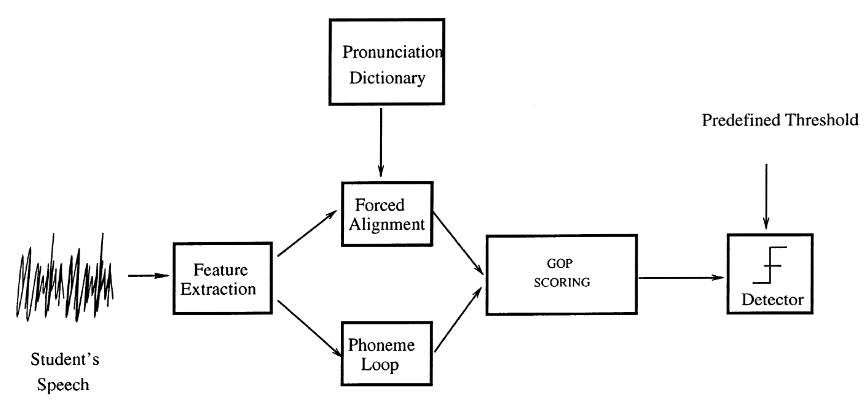
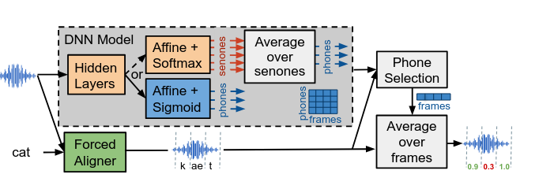
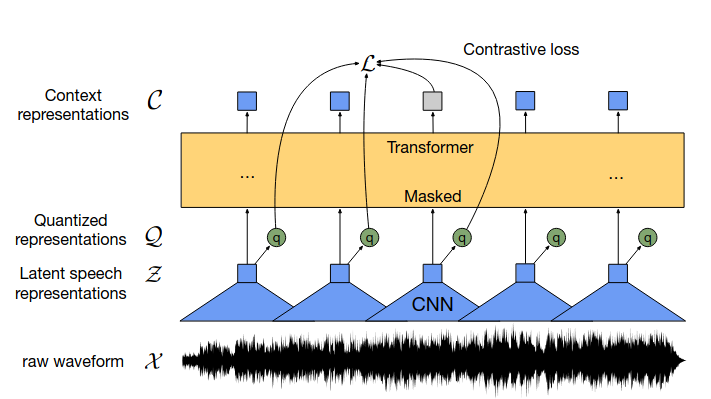

# Tổng quan về Pronunciation Scoring - PS
---

!!! danger "Mô tả"
    - Nhiệm vụ này thuộc [Phase01 - Nghiên cứu tổng quan và chuẩn bị dữ liệu]

        [Phase01 - Nghiên cứu tổng quan và chuẩn bị dữ liệu]: README.md/#ke-hoach-nhiem-vu-chi-tiet

    - Nghiên cứu, khảo sát tổng quan các công trình liên quan đến bài toán PS trong và ngoài nước.
    - Tìm hiểu một số kiến trúc PS tổng thể, hệ thống end-to-ends.

## 1. Giới thiệu chung
---

Hệ thống hỗ trợ học ngôn ngữ bằng máy tính (Computer-Assisted Language Learing - CALL) mang lại nhiều lợi ích thiết thực trong giáo dục, đặc biệt là đối với giáo viên và học sinh. Những hệ thống này cho phép cung cấp phản hồi liên tục cho người học mà không cần sự giám sát thường trực của giáo viên, hỗ trợ việc tự học, khuyến khích sử dụng ngôn ngữ một cách tương tác thay vì phụ thuộc vào các phương pháp học truyền thống như học thuộc lòng hay ghi chép. Bên cạnh đó, CALL cũng góp phần đơn giản hóa và tự động hóa các quy trình đánh giá năng lực ngôn ngữ.

Một trong những thành phần cốt lõi và đầy thác thức trong hệ thông CALL là chấm điểm phát âm (Pronuncation Scoring). Đây là nhiệm vụ quan trọng nhằm đánh giá mức độ chĩnh xác trong các phát âm của người học so với chuẩn của người bản ngữ. Hệ thống chầm điểm phát âm hiệu quả không chỉ giúp phát hiện và sửa lỗi kịp thời mà còn cung cấp phản hồi mang tính dài hạn về năng lực phát âm của người học.

Trong nhiều năm qua, đã có rất nhiều các nghiên cứu, hướng tiếp cận chính như:

- Phương pháp dựa trên mô hình nhận dạng tiếng nói (ASR-based methods): Đây là một trong những phương pháp cổ điển và rất phổ biến, trong đó hệ thống nhận dạng giọng nói thường sử dụng mô hình Markov ẩn (Hidden Markow Model) nhằm so sánh phát âm của người học với các mô hình âm học chuẩn. Một trong những kỹ thuật nổi bật là thuật toán Goodness of Pronunciation (GOP) cho phép tính điểm phát âm ở cấp độ âm vị (phone-level).

- Đánh giá dựa trên so sánh với mẫu người bản ngữ (Template-based / Reference-based methods): Các phương pháp này so sánh trực tiếp tín hiệu âm thanh của người học với bản ghi âm từ người bản ngữ. Chúng thường yêu cầu dữ liệu huấn luyện riêng cho từng từ hoặc cụm từ, khiến hệ thống trở nên text-dependent và rất khó để có thể mở rộng.

- Mô hình học máy và học sâu (Machine Learning / Deep Learning-based methods): Gần đây, các mô hình học sâu như CNN, RNN và đặc biệt là các mô hình transformer-based (wav2vec, HuBERT, v.v.) đước sử dụng để trích xuất đặc trưng âm học và xây dựng bộ chấm điểm phát âm mà không cần phải phụ thuộc hoàn toán vào pipeline của hệ thống nhận dạng truyền thống.

Ngoài ra, các nghiên cứu khác cũng khai thác triệt để những yếu tố đặc trưng của âm thanh như trường độ, ngữ điệu, v.v, nhằm đánh giá chất lượng phát âm một cách toán diện hơn. Tuy nhiên, chúng vấn đang gặp phải rất nhiều những thách thức liên quan đến sự phụ thuộc vào dữ liệu, sự nhất quát và công bằng trong đánh giá và sự thích nghi khi dữ liệu giọng nói đa dạng. 

## 2. Một số phương pháp nổi bật
---
### __2.1 Goodness of Pronuncation__

[**GOP (Goodness of Pronunciation)**](http://svr-www.eng.cam.ac.uk/~sjy/papers/wiyo00.pdf) là phương pháp là một trong những kỹ thuật nổi bật, với mục tiêu đo lường mức độ khớp giữa phát âm của người học và cách phát âm chuẩn của người bản ngữ, tính tại mức âm vị (phone-level). Gỉa sử khi chúng ta phát âm từ **cat** nó sẽ có hai âm vị là **/ka/** và **/et/**. GOP sẽ chấm điểm xem người dùng đã phát âm **/ka/** tốt đến đâu và **/et/** tốt đến đâu. 

!!! info "**Công thức GOP**"

    $$
    \textbf{GOP} = \frac{1}{NF_\text{(p)}} \cdot \left| \text{log} \left( \frac{p(O^\text{(p)}) | p}{\max_{q \in \mathbf{Q}} p(O^\text{(p)}) | q} \right) \right|
    $$

    ^^Trong đó:^^

    - Tử số $p(O^\text{(p)}) | p$: Đây là khả năng đoạn âm thanh $O(p)$ được tạo ra bởi đúng âm vị $p$. Chúng cho biết âm thanh thực tế khớp với âm vị mà chúng ta mong đợi nghe thấy đến mức nào.

    - Mẫu số $\max_{q \in \mathbf{Q}} p(O^\text{(p)}) | q$: Đây là khả năng đoạn âm thanh $O(p)$ được tạo ra bởi âm vị khớp tốt nhất trong tất cả các âm vị $q$. Cho biết âm thanh thực tế giống với âm vị nào nhất trong tất cả các âm vị, bất kể đúng hay sai.

Nếu tỷ lệ $\frac{p(O^\text{(p)}) | p}{\max_{q \in \mathbf{Q}} p(O^\text{(p)}) | q}$ tiến đến gần 1, có nghĩa là âm vị đích khớp rất tốt, và không có âm vị nào khác khớp tốt hơn. Điều này chứng tỏ người đọc đã phát âm rất tốt. Ngược lại, có nghĩa là có một hoặc nhiều âm vị khác khớp với đoạn âm thanh đó hơn so với âm vị đích, đồng nghĩa với người dùng phát âm chưa chuẩn. 

**Hệ thống Pronunciation Scoring:** 

Sơ đồ khối của cơ chế chấm điểm dựa trên phương pháp GOP được thể hiện như trong hình. Cụ thể sẽ trải qua 4 giai đoạn:


/// caption
Hình 1.1: Biểu đồ minh họa các thành phần chính trong hệ thống chấm điểm dựa trên phương pháp GOP truyền thống. 
///

- Front-end Feature Extraction: Đây là giai đoạn đầu tiên, dữ liệu âm thanh đầu vào được xử lý để trích xuất các đặc trưng quan trọng của giọng nói thường là MFCC (Mel-frequency Cepstral Coefficients). Đây là cách biểu điễn âm thanh dưới dạng số.

- Two Recognition Pass: Tiếp theo các transcipts và đặc trưng âm thanh tương ứng sẽ trải qua hai lượt nhận dạng:
    - Forced Alignment Pass: Sử dụng bản ghi đã biết để ép các đặc trưng MFCC khớp với chuỗi phone đúng (đây chính là việc tính toán tử số của công thức GOP). Ví dụ hệ thống nhận đầu vào tín hiệu âm thanh của người đọc là **cat**, hệ thống sẽ sử dụng một từ điển phát âm (pronunciation dictionary), từ điển này chứa cách phát âm chuẩn theo IPA của mỗi từ trong ngôn ngữ. Từ **cat** sẽ được ánh xạ thành chuỗi âm vị chuẩn là **/k/ /ae/ /t/**. Sau đó quá trình ép khung diễn ra, giai đoạn này sẽ xác định thời điểm bắt đầu và kết thúc của từng âm vị trong lời nói của người học và đồng thời gán cho mỗi đoạn âm thanh một âm vị $p$ đúng theo bản ghi chuẩn. Đầu ra của giai đoạn này sẽ có dạng:

    ```yaml title="example.json" linenums="1"
    [
        { "phone": "/k/", "start_time": 0.05, "end_time": 0.18 },
        { "phone": "/æ/", "start_time": 0.18, "end_time": 0.35 },
        { "phone": "/t/", "start_time": 0.35, "end_time": 0.48 }
    ]
    ```

    - Phone Recognition Pass: Sử dụng một "phoneme loop" để nhận dạng đoạn âm thanh $O^{\text{(p)}}$ mà không có ràng buộc về từ vựng. Chúng tìm ra âm vị nào (trong tất cả các âm vị có thể có trong ngôn ngữ) khớp tốt nhất với đoạn âm thanh đó (tính toán mẫu số của GOP).

- GOP scores: Tính toán các điểm GOP riêng lẻ cho từng phone dựa trên các kết quả thu được từ hai lượt nhận dạng.

- Threshold: Sau khi có được điểm GOP cho mỗi phone, lựa chọn một ngưỡng tùy chỉnh nhằm phân loại, nếu điểm GOP của một phone thấp hơn ngưỡng thì âm đó được coi là phát âm kém và ngược lại.

**Hạn chế của phương pháp GOP:**

- Phụ thuộc quá nhiều vào Forced Alignment và HMM (Hidden Markov Model) truyền thống. GOP phụ thuộc hoàn toàn vào độ chính xác của quá trình ép khung để xác định ranh giới của từng âm vị và tính toán likelihood. Nếu quá trình căn chỉnh này không chính xác sẽ dẫn đến điểm GOP không đáng tin cậy.

- Không có mô hình riêng biệt cho lỗi phát âm: GOP truyền thống so sánh âm thanh đầu vào với mô hình của âm vị đúng và tất cả các âm vị khác trong ngôn ngữ đích. Tuy nhiên chúng bỏ qua và không quan tâm đến các loại lỗi phát âm cụ thể thường gặp.

- Không xem xét ngữ cảnh: GOP thường đánh giá từng âm vị một cách tương đối độc lập. Chúng ít khi xét đến ngữ cảnh âm vị xung quanh hoặc ngữ cảnh từ/câu, điều này cũng ảnh hưởng đến cách phát âm và nhận thức về lỗi của con người.

### __2.2 Deep Neural Networks based GOP__

Các hệ thống chấm điểm phát âm thường được huấn luyện chỉ với dữ liệu giọng nói của người bản xứ. Trong khi đó, giọng nói của người học ngôn ngữ (phi bản xứ) lại có nhiều khác biệt, đặc biệt là khi họ phát âm sai. Nhiều nghiên cứu chỉ ra rằng việc huấn luyện hệ thống trực tiếp bằng dữ liệu giọng nói của người học phi bản xứ giúp cho hệ thống tốt hơn. Tuy nhiên việc thu thập dữ liệu và gán nhãn chi tiết dữ liệu giọng nói phi bản xứ là một thách thức lớn gây tốn kém và mất thời gian. Phương pháp này được tiếp cận dựa trên transfer learning [**DNN-based GOP**](https://arxiv.org/pdf/2111.00976) để giải quyết những thách thức này, cụ thể: 

- Tận dụng mô hình đã được huấn luyện cho nhiệm vụ nhận dạng giọng nói trên một lượng lớn dữ liệu người bản xứ.
- Tinh chỉnh mô hình đã được huấn luyện trước với lượng nhỏ dữ liệu phi bản xứ có nhãn.

**Mở rộng công thức tính GOP với DNN:**

So với phương pháp tính toán GOP truyền thống như được trình bày ở [**(1)**](#1-goodness-of-pronunciation), trong đó GOP được tính dựa trên các mô hình âm học GMM (Gausian Mixture Models). Trong những năm gần đây, một loạt các nghiên cứu đã chỉ ra những cải thiện đáng kể khi sử dụng các mô hình âm học dựa trên DNN (Deep Neural Networks). DNN có khả năng học và mô hình hóa các đặc trưng âm thanh phức tạp tốt hơn nhiều so với GMM.

Khi sử dụng các mô hình âm học dựa trên DNN, điểm GOP của một âm vị đích $p$ bắt đầu từ khung thời gian $\text{T}$ và có độ dài $\text{D}$ được tính như sau:

$$
\textbf{GOP}_{p} = -\frac{1}{D} \sum^{\text{T+D-1}}_\text{t=T} \log P_{t}(p|O)
$$

Trong đó:

- $\text{D}$ là độ dài của âm vị, tính bằng số lượng khung thời gian $p$
- $\text{T}$ là khung thời gian bắt đầu của âm vị $p$
- $O$ là toàn bộ chuỗi đặc trưng, được trính xuất từ dạng sóng âm sang các đặc trưng để có thể tính toán, đại diện cho tất cả các dữ liệu âm thanh mà mô hình có thể sử dụng
- $\sum^{\text{T+D-1}}_\text{t=T}$ tổng các giá trị cho tất cả các khung thời gian t nằm trong khoảng từ khung bắt đầu $\text{T}$ đến khung kết thúc $\text{T + D - 1}$ của âm vị $p$.
- $\log P_{t}(p|O)$ là xác xuất hâu nghiệm của âm vị $p$ tại khung thời gian $t$, với điều kiện là toàn bộ chuỗi đặc trưng âm học $O$ đã được quan sát

Sự khác biệt lớn giữa việc tính toán giữa GOP truyền thống và GOP dựa trên DNN là việc chuyển từ likelihood sang posterior. Cụ thể:

- Đối với GOP truyền thống: Đoạn âm thanh $O^{(p)}$ của âm vị $p$ được đưa vào mô hình sinh (generative model) của âm vị $p$. Mô hình này sẽ tính toán khả năng chúng sinh ra $O^{(p)}$.

- Đối với GOP dựa trên DNN: Thay vì tính toán tỉ lệ giữa các likelihood, mô hình DNN trực tiếp đưa ra xác suất hậu nghiệm $P_t(p|O)$ cho âm vị $p$ tại mỗi khung thời gian $t$. 

**Cấu trúc mô hình đề xuất:**

Nhìn chung phương pháp này cũng tương tự như GOP basline truyền thống, cả hai đều tuân thủ theo nhiều quy trình riêng lẻ, từ việc xử lý dữ liệu âm thanh cho đến đưa ra điểm số phát âm cho từng âm vị.



- Giai đoạn tiền xử lý và căn chỉnh ép buộc (Forced Aligner): Đầu vào là một tín hiệu âm thanh (waveform) mà người học phát ra và bản ghi (transcipt) tương ứng. Sau đó vẫn sử dụng bộ căn chỉnh ép buộc để xác định tính chính xác thời điểm bắt đầu và kết thúc của từng âm vị trong lời nói của người học.

- Giai đoạn tạo điểm cấp khung (Frame-level score Generation): Sau khi có các đoạn âm thanh được căn chỉnh cho từng âm vị, các đặc trưng âm học đã được trích xuất cho từng khung nhỏ của toàn bộ tín hiệu âm thanh được đưa vào một mô hình DNN, mô hình này sẽ đưa ra điểm số cho mỗi âm vị có thể có trong ngôn ngữ tại khung đó.

- Lựa chọn điểm cấp khung (Frame-level score selection): 

    - Như đã được đề cập, mô hình DNN trong các hệ thống cơ sở đuọc huấn luyện để đưa ra xác suất hậu nghiệm cho từng senone tại mỗi khung thời gian (nhánh phía trên của khối màu xám). Để có được điểm số cho mỗi âm vị tại mỗi khung, các xác suất hậu nghiệm của tất cả các senone thuộc về cùng một âm vị đó sẽ được tổng hợp lại. Mục đích là chuyển đổi đầu ra chi tiết của DNN (cấp senone) về cấp độ âm vị (phone) để tính toán GOP.

    - Mô hình đề xuất (nhánh phía dưới khối màu xám), thay vì phải đi qua các senone trung gian rồi tổng hợp, mô hình DNN được thiết kế và huấn luyện trực tiếp để đưa ra xác suất hậu nghiệm cho từng âm vị tại mỗi khung thời gian. 

    - Sau khi DNN đã tạo ra điểm số cho tất cả các âm vị tại mỗi khung, bước này sẽ chọn ra điểm số của âm vị đúng $p$ tại từng khung. Ví dụ nếu Forced Aligner cho rằng khung $t$ thuộc về âm vị **/k/** thì ta sẽ lấy giá trị P_t(**/k/**|O) từ đầu ra của DNN tại khung đó.

- Giai đoạn tính toán điẻm phát âm: Đối với mỗi âm vị $p$ đã được xác định bởi Forced Aligner, lấy tất cả các điểm số cấp khung đã được lựa chọn ở bước trước. Các điểm số này sau đó được trung bình hóa trên toàn bộ các khung mà âm vị đó chiếm giữ. Giả sử âm vị **/k/** kéo dài 10 khung từ ($f_1$ đến $f_{10})$, điểm GOP của **/k/** sẽ được tính bằng cách lấy trung bình của $[P_{f1}(/k/|O),...,P_{f10}(/k/|O)]$. 


### __2.3 wav2vec__

Mô hình này là một phương pháp hiệu quả và hiện đại nhằm mục đích xây dựng hệ thống nhận dạng tiếng nói thông qua học tự giám sát, giúp giải quyết vấn đề thiếu dữ liệu có nhãn. Chúng học cách mã hóa âm thanh thành các biểu diễn tiềm ẩn, sau đó che đi một phần và sử dụng kiến trúc Transformer tạo ra các biểu diễn ngữ cảnh hóa và phân biệt chúng với các yếu tố gây nhiễu, đồng thời học được các đơn vị tiếng nói rời rạc. Phương pháp này đạt được hiệu suất rất tốt, đặc biệt ấn tượng ở các trường hợp có rất ít dữ liệu có nhãn.

[wav2vec 2.0]: https://arxiv.org/pdf/2006.11477

Kiến trúc của mô hình __[wav2vec 2.0]__ (__Hình 2.1__) tập trung vào ba thành phần chính: Bộ mã hóa đặc trưng (feature encoder), mạng Transformer để tạo biểu diễn ngữ cảnh (contextualized representations with transformers), và lượng tử hóa (quantization module).



/// caption
__Hình 2.1: Kiến trúc thành phần cơ bản của mô hình wav2vec__
///

__a. Bộ mã hóa đặc trưng (feature encoder)__

Mục đích của quá trình này là chuyển đổi toàn bộ sóng âm thanh thô thành các biểu diễn tiềm ẩn có ỹ nghĩa. Bộ mã hóa này được cấu tạo bởi nhiều khối, mỗi khối chứa các thành phần như:

- Tích chập thời gian (temporal convolution): Đây là một loại mạng tích chập chuyên dùng cho dữ liệu chuỗi (như âm thanh). Chúng lần lượt quét qua dữ liệu theo thời gian đề trích xuất các đặc trưng cục bộ.

- Chuẩn hóa lớp (layer normalization): Kỹ thuật này giúp ổn định quá trình huấn luyện của mạng nơ-ron bằng cách chuẩn hóa đầu ra của mỗi lớp.

- Hàm kích hoạt GELU: Hàm này giúp mạng học được các mối quan hệ phức tạp trong dữ liệu.

__b. Biểu diễn được ngữ cảnh hóa với Transformer (contextualized representations with transformers)__

Giả sử các âm thanh thô sau khi đi qua feature encoder là các biểu diễn tiềm ẩn $Z$, chúng sẽ được đưa vào các kiến trúc Transformers để tạo ra các biểu diễn $C$ nắm bắt được ngữ cảnh của toàn bộ chuỗi. Có một sự khác biệt nhỏ trong việc nhúng vị trí (positional embeddings), thay vì dùng nhúng vị trí cố định như phương pháp truyền thống, ở giai đoạn này một lớp tích chập được cài đặt để tạo ra nhúng vị trí tương đối. Hiểu một cách nôm na, thay vì nói "phần tử này ở vị trí thứ 10", thì chúng sẽ tập trung vào "phần tử này cách phần từ kia với khoảng cách là bao xa".

__c. Module lượng tử hóa (quantization module)__

Chuyển đổi các biểu diễn tiếng nói tiềm ẩn liên tục $Z$ thành một tập hợp rời rạc (discrete) các biểu diễn. Các biểu diễn rời rạc này được sử dụng làm mục tiêu trong tác vụ học tự giám sát. Trong mô hình này lượng tử hóa tích (product quantization - PQ) được sử dụng. Đây là một kỹ thuật để lượng tử hóa các vector nhiều chiều thành nhiều phần nhỏ (các nhóm hoặc codebook). Giả sử ta có một vector đặc trưng $d$ chiều. PQ sẽ chia $d$ chiều này thành $G$ nhóm, mỗi nhóm có $\frac{d}{G}$ chiều. Với mỗi nhóm, sẽ chứa một codebook riêng và mỗi codebook sẽ chứa nhiều vector con.

Để dễ hình dung hơn, nếu ta có một bức ảnh kỹ thuật số, màu sắc trong bức ảnh được biểu diễn bằng nhiều giá trị số liên tục. Nếu muốn giảm đi dung lượng file hoặc muốn lưu trữ chúng trên một thiết bị có bộ nhớ hạn chế, thì lượng tử hóa màu sắc sẽ được sử dụng. Thay vì có hàng triệu sắc thái màu liên tục, ta chỉ cho phép ảnh sử dụng một tập hợp rời rạc có thể là 100 màu chuẩn hoặc ít hơn. Mỗi điểm ảnh sẽ được làm tròn hoặc quy về một màu gần nhất trong tập hợp màu giới hạn đó.

Biểu diễn tiếng nói tiềm ẩn $Z$ mà bộ mã hóa tạo ra là các giá trị liên tục, vì vậy mục tiêu chính của lượng tử hóa là cố gắng chuyển đổi chúng về một tập hợp hữu hạn rời rạc các mã hoặc đơn vị. Nếu từ một đoạn âm thanh đầu vào, ta mong muốn phân loại từ một chuỗi các âm thanh liên tục đó thành các âm (như a, b, c) rõ ràng, thay vì là một dải âm liên tục không định hình. Việc này giúp mô hình dễ dàng học được các đơn vị cơ bản của tiếng nói.

Lượng tử hóa giúp cho việc xử lý dữ liệu và lưu trũ dễ dàng hơn và các biểu diễn đã được lượng tử hóa $Q$ được dùng làm mục tiêu (targets) cho tác vụ học tự giám sát. Mô hình phải cố gắng dự đoán hoặc tái tạo lại các đơn vị rời rạc này.

Codebook có thể coi là một tử điển hoặc một bộ sưu tập các mã hoặc mẫu đã được định nghĩa trước. Chúng được xây dựng một cách tự động thông qua quá trình huấn luyện tự giám sát của mô hình. Trong quá trình huấn luyện, codebook được hình thành nhờ sự hỗ trợ bởi các hàm mất mát (contrastive loss, diversity loss) và các kỹ thuật như gumble softmax để trở thành một tập hợp các đơn vị tối ưu, có khả năng biểu diễn hiệu quả các đặc trưng cơ bản của dữ liệu âm thanh không có nhãn.

- Ban đầu khi mô hình chưa được huấn luyện, các vector trong codebook được khởi tạo ngẫu nhiên. Chúng có thể là những tập hợp số vô nghĩa.

- Codebook được học và cập nhật cùng với phần còn lại của mô hình (bộ mã hóa đặc trưng và transformer) thông qua tác vụ tự giám sát. Để có được nhãn cho việc dự đoán mà không cần con người, các biểu diễn tiềm ẩn $Z$ (thường là các phần không bị che từ các khoảng thời gian khác) được đưa ra PQ để tạo ra các đơn vị rời rạc. Chính các đơn vị này đóng vai trò là nhãn tự tạo cho mô hình.

- Khi mô hình dự đoán một biểu diễn ngữ cảnh cho một đoạn âm thanh bị che, chúng sẽ so sánh dự đoán đó với một trong các đơn vị rời rạc từ codebook (đây là mục tiêu/nhãn đúng cho đoạn bị che đó). Nếu dự đoán của mô hình chưa tốt, hàm mất mát (constractive loss) sẽ đưa ra mức độ sai lệch. 

__d. Gumble Softmax__

Việc chọn lực một vector rời rạc từ một codebook thường không thể khả vi, tức là sẽ không thể tính toán gradient cho quá trình cập nhật trọng số mạng. Gumbel softmax là một kỹ thuật nhằm giải quyết vấn đề này, chúng cho phép chọn các vector rời rạc một cách khả vi hoàn toàn, điều này có nghĩa là ta có thể thực hiện lan truyền ngược qua quá trình lựa chọn rời rạc đề huấn luyện toàn bộ mô hình. Công thức của Gumbel softmax được thiết kế như sau:

$$
P_{g,v} = \frac{exp(l_{g,v} + n_{v}) / \tau}{\sum^{V}_{k=1} exp(l_{g,k} + n_{k}) / \tau}
$$

Công thức này tính toán xác suất để chọn mục nhập thứ $v$ từ sổ mã của nhóm $g$, $l_{g,v}$ là các đầu ra chưa chuẩn hóa của một lớp tuyến tính. Gumbel softmax có sử dụng một tham số nhiệt độ $\tau$ giúp cho quá trình lựa chọn trở nên mềm mại hơn trong quá trình truyền tiến, và sử dụng một bộ ước tính có tên là straight-through để đảm báo gradient truyền ngược chính xác trong quá trình truyền ngược.

__e. Contrastive Loss__

Đây là hàm mất mát tương phản giúp mô hình có thể phân biệt được giữa biểu diễn tiếng nói tiềm ẩn được lượng tử hóa đúng (positive sample) và các biểu diễn sai (negative sample) cho một vị trí bị che. Hàm này được định nghĩa bằng công thức sau:

$$
\mathcal{L}_{m} = -\text{log} \frac{exp(sim(c_{t}, q_{t})/k)}{\sum_{\tilde{q} \sim Q_{t}} exp(sim(c_{t}, \tilde{q}) / k)}
$$

Mô hình sẽ nhận đầu ra từ mạng transformer là $c_{t}$, tập trung vào một bước thời gian $t$ đã bị che, $c_t$ là biểu diễn ngữ cảnh mà transformer đã tạo ra, cố gắng nắm bắt thông tin từ toàn bộ chuỗi. Sau đó mô hình cần xác định đâu là biểu diễn tiếng nói tiềm ẩm được lượng tử hóa đúng $q_{t}$ cho bước thời gian $t$, $q_{t}$ được tạo ra từ biểu diễn tiềm ẩn gốc (không bị che) tại vị trí $t$, sau khi đi qua module lượng tử hóa. Để làm được điều này, mô hình được đưa ra một tập hợp $K+1$ ứng cử viên cho $\tilde{q}$. Tập hợp này bao gồm:

- $q_{t}$ biểu diễn đúng
- $K$ là phần tử gây nhiễu, các biểu diễn này được lấy mẫu ngẫu nhiên từ các bước thời gian bị che khác trong cùng một file âm thanh. 

__f. Diversity Loss__

Công thức của Diversity Loss (hàm mất mát đa dạng) được biểu diễn như sau:

$$
\mathcal{L}_{d} = \frac{1}{GV} \sum^{G}_{g=1} - H(\overline{p}_{g}) == \frac{1}{GV} \sum^{G}_{g=1} \sum^V_{v=1} \overline{p}_{g,v} \log \overline{p}_{g,v}
$$

Trong đó:

- $H(\overline{p}_{g})$ là ký hiệu cho entropy phân phối của $\overline{p}_{g}$.
- $\sum^V_{v=1} \overline{p}_{g,v} \log \overline{p}_{g,v}$ là công thức tính toán entropy.
- $\frac{1}{GV}$ là hệ số chuẩn hóa, trung bình hóa hàm mất mát trên tất cả $G$ codebook và $V$ vector trong mỗi codebook.

Hàm mất mát đa dạng này được áp dụng khuyến khích mô hình sử dụng tất cả hoặc phần lớn các vector trong các codebook một cách đồng đều, thay vì chỉ tập trung vào một vài vector đặc trưng phổ biến. Nếu không có hàm mất mát này, có thể một số vector trong codebook không bao giờ được sử dụng. Điều này sẽ vô tình làm lãng phí khả năng biểu diễn của codebook và hạn chết tính đa dạng của các đơn vị mà mô hình học được.

### __2.4 Một số phương pháp khác__

| No. | Methods | Desciption |
| :-: | :-----: | :--------- |
| #1  | 3MH <br> [[paper](https://arxiv.org/pdf/2305.18146v4)] | Mô hình đa tầng (multi-head) học đồng thời nhiều khía cạnh như accuracy, stress, fluency ở mức từ - tăng khả năng đánh giá từ toàn diện hơn |
| #2  | GOPT-PAII <br> [[paper](https://arxiv.org/pdf/2205.03432v1)] | Mô hình Transformer đánh giá phát âm theo nhiều khía cạnh đồng thời (accuracy, fluency, completeness, prosody…) và nhiều mức (phoneme, word, utterance) |
| #3  | HierCB + ConPCO <br> [[paper]()] | Áp dụng contrastive learning kết hợp ordinal regression để tạo embedding âm vị phân biệt và duy trì thứ tự đánh giá, giúp chấm điểm phát âm chính xác hơn |
| #4  | SpeechBlender + LSTM <br> [[paper](https://arxiv.org/pdf/2211.00923v3)] | Dùng kỹ thuật data augmentation đặc biệt (SpeechBlender) để mô phỏng lỗi phát âm, huấn luyện LSTM nhận biết phát âm sai hiệu quả ngay cả khi thiếu dữ liệu thực |
| #5 | HiPAMA–LibriSpeech [[paper](https://arxiv.org/pdf/2211.08102v2)] | Mô hình phân cấp (phoneme → word → utterance) sử dụng multi-aspect attention, kết hợp nhiều khía cạnh (accuracy, fluency, completeness…) theo từng cấp độ ngôn ngữ  |


---
